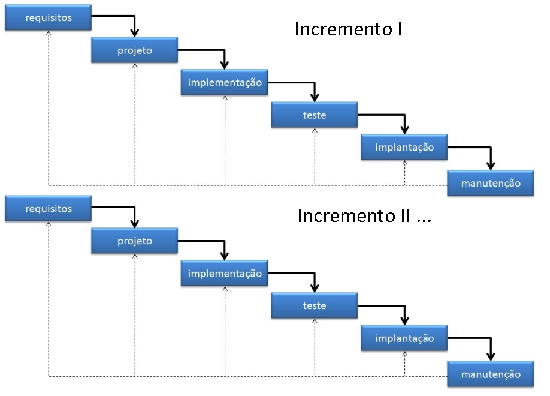
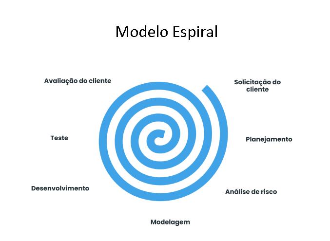
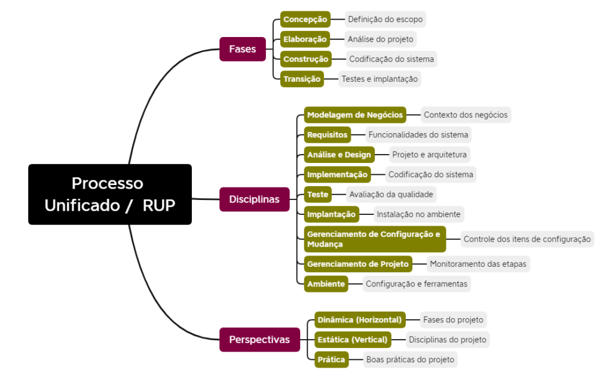

# PROCESSO DE SOFTWARE

## CONCEITO DE PROCESSO, ATIVIDADES E TAREFAS

No mundo dos negócios como é conceituado um processo ?

> *Um PROCESSO é um conjunto de atividades que são executadas para atingir um objetivo* (Business Process Model and Notation - BPMN)
>
> *ATIVIDADES são os trabalhos que devem ser realizados para que um processo seja executado* (Business Process Model and Notation - BPMN)
>
> *TAREFAS são decomposições de atividades e representam um conjunto de passos ou ações executadas para realizar um trabalho. Essas tarefas logicamente relacionadas quando encadeadas completam a atividade.* (Business Process Model and Notation - BPMN)

## O PROCESSO DE SOFTWARE

> *PROCESSO DE SOFTWARE é uma metodologia que define as atividades necessárias para desenvolver um software de qualidade* (Roger S Pressman)

> *PROCESSO DE SOFTWARE é um conjunto de atividades que visam a produção de um software* (Ian Sommerville)

## ATIVIDADES FUNDAMENTAIS DE UM PROCESSO DE SOFTWARE

**POR QUAIS ATIVIDADES VOCÊ (NECESSÁRIAMENTE) PASSA ?**

+--------------+--------------+--------------+--------------+--------------+
| ATIVIDADE #1 | ATIVIDADE #2 | ATIVIDADE #3 | ATIVIDADE #4 | ATIVIDADE #5 |
+==============+==============+==============+==============+==============+
| comunicação  | planejamento | modelagem    | construção   | entrega      |
+--------------+--------------+--------------+--------------+--------------+

: PROCESSO DE SOFTWARE - ATIVIDADES - PRESSMAN

+---------------+--------------+---------------+--------------+--------------+
| ATIVIDADE #1  | ATIVIDADE #2 | ATIVIDADE #3  | ATIVIDADE #4 | ATIVIDADE #5 |
+===============+==============+===============+==============+==============+
| especificação | projeto      | implementação | validação    | evolução     |
+---------------+--------------+---------------+--------------+--------------+

: PROCESSO DE SOFTWARE - ATIVIDADES - SOMMERVILLE

## MODELOS DE PROCESSO DE SOFTWARE

**COMO VOCÊ PASSA POR ESSAS ATIVIDADES ?**

### ABORDAGEM CASCATA

#### VANTAGENS DESSE MODELO

+---------------------------------+--------------------------------------------------------------------------------------------------------------------------------------------+---------+
| Vantagem                        | Descrição                                                                                                                                  | Exemplo |
+---------------------------------+--------------------------------------------------------------------------------------------------------------------------------------------+---------+
| Simplicidade                    | -   fácil de entender e implementar;                                                                                                       |         |
|                                 |                                                                                                                                            |         |
|                                 | -   pois possui fases sequenciais bem definidas, com entregas e revisões em cada etapa;                                                    |         |
|                                 |                                                                                                                                            |         |
|                                 | -   facilita o gerenciamento do projeto, especialmente para equipes menores;                                                               |         |
+---------------------------------+--------------------------------------------------------------------------------------------------------------------------------------------+---------+
| Documentação                    | -   Natureza estruturada do                                                                                                                |         |
|                                 |                                                                                                                                            |         |
|                                 | -    Exige a produção de documentação completa em cada fase;                                                                               |         |
|                                 |                                                                                                                                            |         |
|                                 | -   Útil para rastrear o progresso, facilitar a comunicação entre as partes;                                                               |         |
+---------------------------------+--------------------------------------------------------------------------------------------------------------------------------------------+---------+
| Controle                        | -   maior controle sobre o projeto, escopo, os prazos e os custos são definidos no início e seguidos rigorosamente;                        |         |
|                                 |                                                                                                                                            |         |
|                                 | -   Cliente tenha previsão precisa do resultado final e investimento necessário.;                                                          |         |
+---------------------------------+--------------------------------------------------------------------------------------------------------------------------------------------+---------+
| Adequado para projetos estáveis | -   Adequado para projetos com requisitos bem definidos e estáveis e que não devem sofrer muitas alterações ao longo do desenvolvimento.   |         |
+---------------------------------+--------------------------------------------------------------------------------------------------------------------------------------------+---------+

#### DESVANTAGENS DESSE MODELO

+--------------------+-----------------------------------------------------------------------------------------------------------------------------------------------------+------------------------------------------------------------------------------------------------------------------------------------------------------------------------------------------------------------------------------------------------------------------------------------------------------------------------------------------------+
| Desvantagem        | Descrição                                                                                                                                           | Exemplos                                                                                                                                                                                                                                                                                                                                       |
+--------------------+-----------------------------------------------------------------------------------------------------------------------------------------------------+------------------------------------------------------------------------------------------------------------------------------------------------------------------------------------------------------------------------------------------------------------------------------------------------------------------------------------------------+
| Inflexibilidade    | -   Rigidez. Uma vez que uma fase é concluída, é difícil voltar atrás e fazer alterações.                                                           | Se o projeto é feito em um produto comercial (biblioteca) e ela deixa de ser suportada pelo fabricante, o projeto vai ter que nascer com uma tecnologia morta; Seu projeto nasceu no skype, não vai poder migrar para o teams no meio da construção;                                                                                           |
|                    |                                                                                                                                                     |                                                                                                                                                                                                                                                                                                                                                |
|                    | -   problemático se os requisitos mudarem ou se surgirem problemas inesperados                                                                      |                                                                                                                                                                                                                                                                                                                                                |
+--------------------+-----------------------------------------------------------------------------------------------------------------------------------------------------+------------------------------------------------------------------------------------------------------------------------------------------------------------------------------------------------------------------------------------------------------------------------------------------------------------------------------------------------+
| Feedback tardio    | -   O cliente só tem contato com o produto final nas últimas fases do projeto;                                                                      | O cliente iniciou um projeto de aplicativo na plataforma ANDROID. Durante o desenvolvimento o cliente que o aplicativo rode em plataforma IOS (iPHONE). Não é possível, mesmo que o cliente tenha um pequeno montante de dinheiro para investir;                                                                                               |
|                    |                                                                                                                                                     |                                                                                                                                                                                                                                                                                                                                                |
|                    | -   Difícil identificação de erros ou inadequações;                                                                                                 |                                                                                                                                                                                                                                                                                                                                                |
|                    |                                                                                                                                                     |                                                                                                                                                                                                                                                                                                                                                |
|                    | -   Atrasos, custos adicionais e insatisfação do cliente;                                                                                           |                                                                                                                                                                                                                                                                                                                                                |
+--------------------+-----------------------------------------------------------------------------------------------------------------------------------------------------+------------------------------------------------------------------------------------------------------------------------------------------------------------------------------------------------------------------------------------------------------------------------------------------------------------------------------------------------+
| Longos prazos      | -   prazos de entrega mais longos,                                                                                                                  | Você definiu o prazo de entrega em 6 meses, mas devido a rotatividade de funcionários, seu projeto atrasou 3 meses; Os funcionários de equipes de etapas dependentes ficam ociosos naquele projeto;                                                                                                                                            |
|                    |                                                                                                                                                     |                                                                                                                                                                                                                                                                                                                                                |
|                    | -   cada fase precisa ser concluída antes da próxima ser iniciada.                                                                                  |                                                                                                                                                                                                                                                                                                                                                |
|                    |                                                                                                                                                     |                                                                                                                                                                                                                                                                                                                                                |
|                    | -   problemático em projetos com restrições de tempo ou em mercados dinâmicos.                                                                      |                                                                                                                                                                                                                                                                                                                                                |
+--------------------+-----------------------------------------------------------------------------------------------------------------------------------------------------+------------------------------------------------------------------------------------------------------------------------------------------------------------------------------------------------------------------------------------------------------------------------------------------------------------------------------------------------+
| Risco de insucesso | Falta de flexibilidade e feedback tardio podem aumentar o risco de o projeto não atender às expectativas do cliente ou às necessidades do mercado.  | O cliente do estacionamento comprou um sistema ERP para uma loja de calçados; O sistema foi desenhado para cadastrar calçados; Contudo a loja é uma magazine e o cliente durante o projeto começou a vender roupas; O cadastro de mercadorias não suporta roupas; O cliente só descobriu a falta de suporte no momento da entrega do software; |
+--------------------+-----------------------------------------------------------------------------------------------------------------------------------------------------+------------------------------------------------------------------------------------------------------------------------------------------------------------------------------------------------------------------------------------------------------------------------------------------------------------------------------------------------+

### ABORDAGEM INCREMENTAL

#### VANTAGENS DESSE MODELO

+------------------------------------------+--------------------------------------------------------------------------------------------------------+---+
| Vantagem                                 | Descrição                                                                                              |   |
+------------------------------------------+--------------------------------------------------------------------------------------------------------+---+
| Entrega antecipada de software funcional | -   permite que o cliente tenha acesso a funcionalidades do software em estágios iniciais do projeto.  |   |
|                                          |                                                                                                        |   |
|                                          | -   possibilita feedback do cliente;                                                                   |   |
+------------------------------------------+--------------------------------------------------------------------------------------------------------+---+
| Melhor gerenciamento de riscos           | -   Divide o projeto em incrementos menores;                                                           |   |
|                                          |                                                                                                        |   |
|                                          | -   Riscos menores possível identificar e corrigir problemas em etapas iniciais;                       |   |
+------------------------------------------+--------------------------------------------------------------------------------------------------------+---+
| Flexibilidade para mudanças              | -   Mais adaptável a mudanças nos requisitos do cliente, sem comprometer o andamento do projeto.       |   |
+------------------------------------------+--------------------------------------------------------------------------------------------------------+---+
| Feedback contínuo do cliente             | -   incentiva o envolvimento do cliente durante todo o processo de desenvolvimento;                    |   |
|                                          |                                                                                                        |   |
|                                          | -   Cliente testa e avalia as funcionalidades em cada incremento;                                      |   |
|                                          |                                                                                                        |   |
|                                          | -   Produto final torna-se mais alinhado com as expectativas do cliente.                               |   |
+------------------------------------------+--------------------------------------------------------------------------------------------------------+---+
| Melhor aproveitamento de recursos        | -   Equipe de desenvolvimento trabalhe mais eficiente, concentrando-se em um incremento de cada vez;   |   |
|                                          |                                                                                                        |   |
|                                          | -   "Pode" reduzir os custos do projeto;                                                               |   |
+------------------------------------------+--------------------------------------------------------------------------------------------------------+---+

#### DESVANTAGENS DESSE MODELO

+----------------------------------+--------------------------------------------------------------------------------------------------------+-------------------------------------------------------------------------------------------------------------------------------------------------------------------------------------------------------------------------------------------------------------------------------------------------------------------------------------------------------------------------------+
| Desvantagem                      | Descrição                                                                                              |                                                                                                                                                                                                                                                                                                                                                                               |
+----------------------------------+--------------------------------------------------------------------------------------------------------+-------------------------------------------------------------------------------------------------------------------------------------------------------------------------------------------------------------------------------------------------------------------------------------------------------------------------------------------------------------------------------+
| Requisitos bem definidos         | -   Se os requisitos não estão bem definidos, o orçamento vai estourar;                                | Um software foi projetado para ter frontend em janelas e computadores; No primeiro incremento o cliente resolve que é melhor acrescentar suporte a WEB (frontend no navegador); No segundo incremento o cliente resolve que o software deve ter suporte a frontend de dispositivos móveis (app);                                                                              |
+----------------------------------+--------------------------------------------------------------------------------------------------------+-------------------------------------------------------------------------------------------------------------------------------------------------------------------------------------------------------------------------------------------------------------------------------------------------------------------------------------------------------------------------------+
| Planejamento cuidadoso           | -   Se o incremento não for bem planejado, gera mais incrementos ; Bola de Neve                        | O time de Planejamento definou que o software seria no code e seria feito em plataforma Buble (onde o Banco de dados é interno da solução). Surgiu a necessidade de integração com outros bancos de dados pré-existentes de terceiros. Precisa mudar a solução para WeWEB. Surgiu a necessidade de inserir gateway de pagamento. Melhor migrar o projeto para python e FLASK; |
+----------------------------------+--------------------------------------------------------------------------------------------------------+-------------------------------------------------------------------------------------------------------------------------------------------------------------------------------------------------------------------------------------------------------------------------------------------------------------------------------------------------------------------------------+
| Integração dos incrementos       | -   Incrementos não são necessáriamente lineares se existirem funcionalidades forem dependentes;       | Seu sistema gera um relatório de uso de veículos da empresa por funcionários; Você vai construir banco de dados próprio, mas precisa acessar a base de dados do RH e a base de dados da Gerencia de Materiais da empresa; O acesso da tabela depende de aprovação das áreas; Seu sistema não anda enquanto dos outrso bancos não sair;                                        |
+----------------------------------+--------------------------------------------------------------------------------------------------------+-------------------------------------------------------------------------------------------------------------------------------------------------------------------------------------------------------------------------------------------------------------------------------------------------------------------------------------------------------------------------------+
| Necessidade de equipe experiente | -   Exige um alinhamento e comunicação muito grande entre a equipe de desenvolvimento; Time entrosado; | Tanto na atividade de planejamento quanto na de execução, Equipe de frontend precisa de informações de APIs da equipe de backend; Equipe de backend precisa de acessos a fontes de dados externas, caso seja necessário;                                                                                                                                                      |
+----------------------------------+--------------------------------------------------------------------------------------------------------+-------------------------------------------------------------------------------------------------------------------------------------------------------------------------------------------------------------------------------------------------------------------------------------------------------------------------------------------------------------------------------+

### ABORDAGEM Espiral

### ABORDAGEM RUP (Rational Unified Process)

### ABORDAGEM(ENS) ÁGIL(EIS)
