# QUALIDADE DE SOFTWARE

## COMPLIANCE

Para que uma organização consiga fechar contrados de venda ou fornecimento com outra organização, especialmente quando o valor do contrato de venda ou prestação é muito alto, há um processo de checagem de COMPLIANCE:

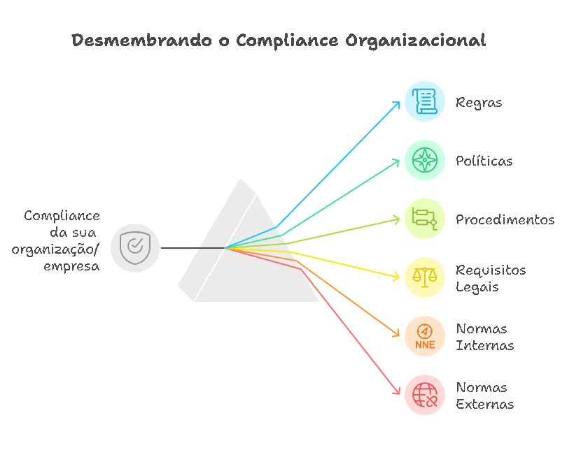

## QUALIDADE

O que é Qualidade ? (Definição ISO 9000)

> Qualidade é definida como o grau em que um conjunto de características inerentes de um objeto satisfaz requisitos onde: **Características inerentes** São propriedades que fazem parte do objeto, onde:
>
> -   **Requisitos**: São as necessidades ou expectativas declaradas, geralmente implícitas ou obrigatórias;
>
> -   **objeto** pode ser representado por um produto, serviço, processo, organização, sistema ou pessoa;

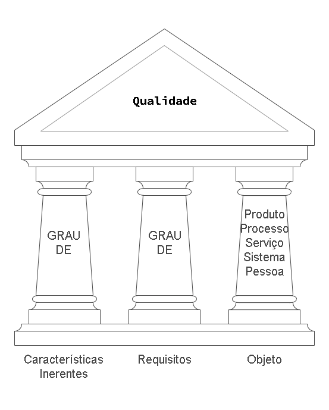

### QUALIDADE APLICADA A PRODUTO

O CONTROLE DE QUALIDADE do PRODUTO concentra-se em aperfeiçoar:

-   as **características** e

-   o **desempenho** do produto em si,

visando atender às necessidades e expectativas dos clientes.

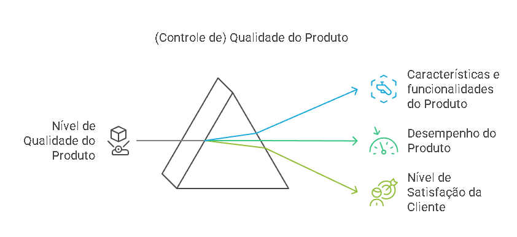

+-----------------------------------------------------------------------+
| Resultados do CONTROLE DE QUALIDADE aplicado ao PRODUTO               |
+=======================================================================+
| -   Aumento no GRAU das características e funcionalidades do produto. |
+-----------------------------------------------------------------------+
| -   Aumento no GRAU de desempenho do produto.                         |
+-----------------------------------------------------------------------+
| -   Aumento no GRAU de nível de satisfação do cliente.                |
+-----------------------------------------------------------------------+

: Resultado esperado do CONTROLE DE QUALIDADE aplicado ao PRODUTO

### QUALIDADE APLICADA A PROCESSO

O CONTROLE DE QUALIDADE DE PROCESSO concentra-se em aperfeiçoar

-   as **atividades** e

-   melhor **aplicação dos recursos**

utilizados para criar o produto, visando garantir a consistência e a eficácia da produção.

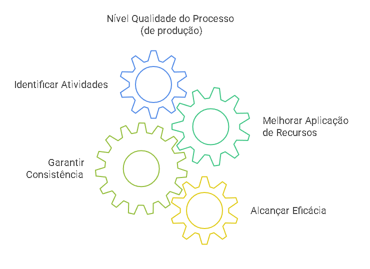

+-----------------------------------------------------------------------+
| Resultados do CONTROLE DE QUALIDADE aplicado ao PROCESSO              |
+=======================================================================+
| -   **identificar** as ATIVIDADES do processo.                        |
+-----------------------------------------------------------------------+
| -   **Garantir a Consistência** as ATIVIDADES do processo.            |
+-----------------------------------------------------------------------+
| -   **Melhorar** a APLICAÇÃO DE RECURSOS do processo.                 |
+-----------------------------------------------------------------------+
| -   Alcançar a **EFICÁCIA.**                                          |
+-----------------------------------------------------------------------+

### CASO MACDONALDS - Qualidade de Produto e Processo

O filme "Fome de Poder" ("The Founder", no original) narra a história real da ascensão da rede McDonald's, desde sua origem como uma pequena hamburgueria na Califórnia até se tornar um império global do fast-food.

-   Reconhecimento da **qualidade do produto** - hamburguers McDonalds

Reconhecimento da **Qualidade do Processo** de fabricação do Produto

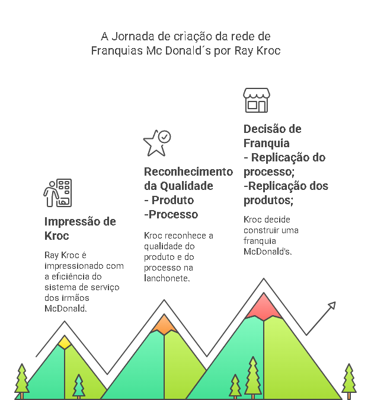

-   Reconhecimento da Capacidade de Franquia (Replicação):

{width="407"}

### QUALIDADE NAS ORGANIZAÇÕES

### Família ISO 9000

**A NBR ISO 9000** é um conjunto de normas técnicas que estabelecem diretrizes e padrões para a criação de um **Sistema de Gestão da Qualidade (SGQ)**.

O sistema SGQ (um si que pode ou não ser um pacote de software) deve mapear

+:---------------------------------:+:---------:+:---------:+:-------------:+:-----------------:+
| Áreas mapeadas por um sistema SGQ | PROCESSOS | POLÍTICAS | PROCEDIMENTOS | RESPONSABILIDADES |
+-----------------------------------+-----------+-----------+---------------+-------------------+

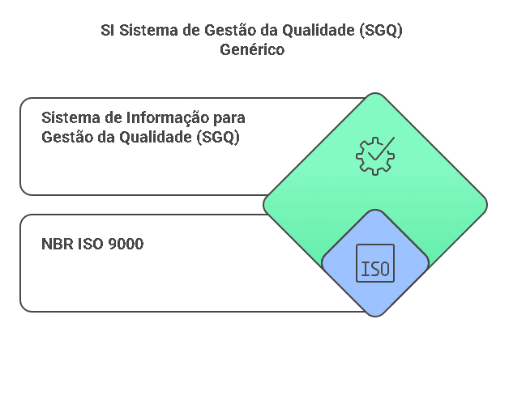{width="549"}

### Família ISO 14000

**A NBR ISO 14000** é um conjunto de normas técnicas que tratam de GESTÃO AMBIENTAL nas organizações. Estabelecem normas e diretrizes para criar **(SI) Sistemas de Gestão Ambiental (SGA)**:

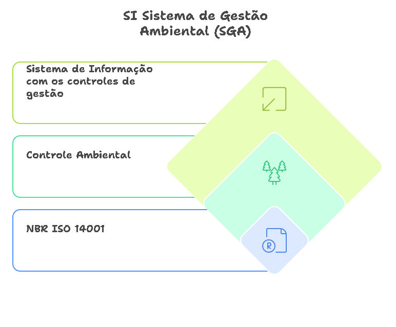

### Família ISO 27000

**NBR ISO 27000**, trata de normas para **gestão segurança da Informação.** Fornecem um framework para a gestão da segurança da informação em organizações.

Especifica os requisitos para um para a criação de um(SI) Sistema de Gestão de Segurança da Informação (SGSI).

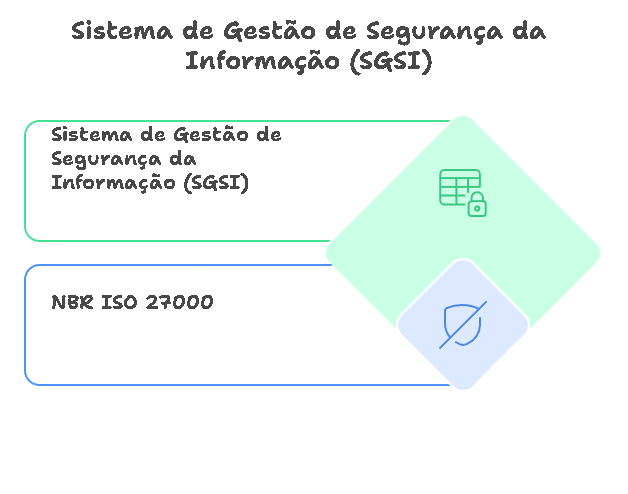

### Segmentos das Organizações e Adoção das normas de Qualidade

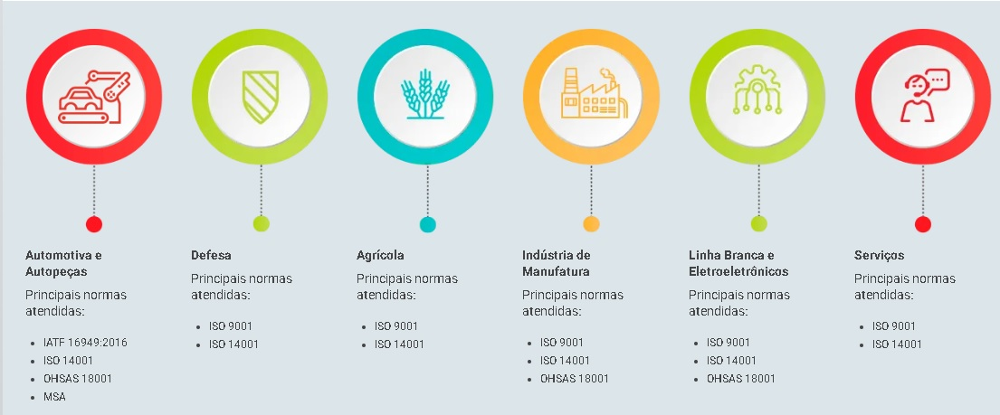

### QUALIDADE NA ENGENHARIA DE SOFTWARE

A qualidade de software não define S.I.s

### Família NBR ISO 9126

Focava na qualidade do produto de software, definindo um conjunto de parâmetros para padronizar a avaliação dessa qualidade. Ela se enquadrava no modelo de qualidade das normas da família 9000.

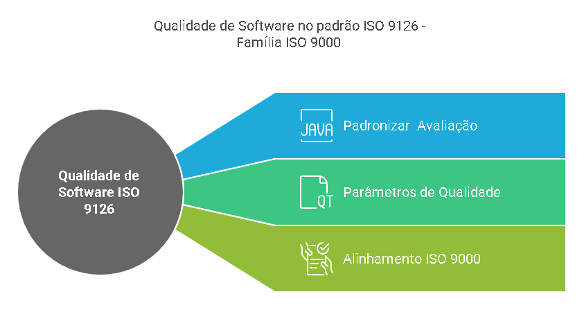

### Família NBR ISO 12207

A norma ISO 12207 define um conjunto de processos para o ciclo de vida do software. Seu principal foco é estabelecer um framework padronizado para o desenvolvimento, manutenção e descarte de software, visando garantir a qualidade e a eficiência desses processos.

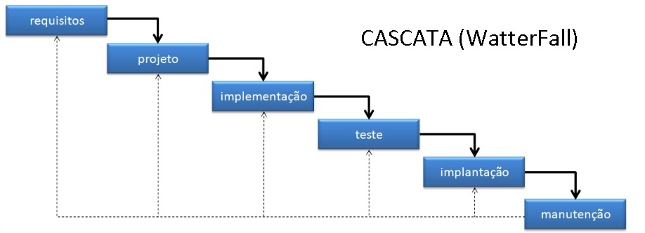

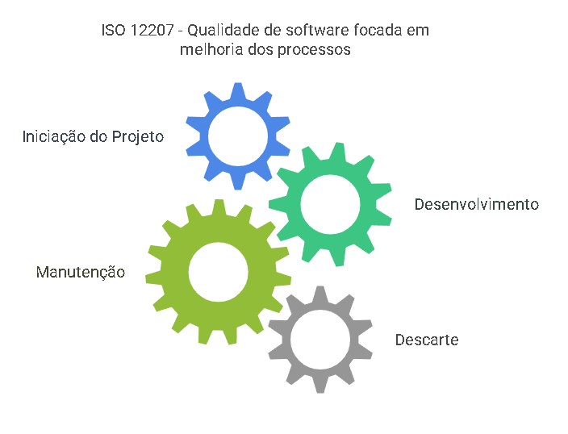

### Família NBR ISO 25000

**A NBR ISO 25000**, também conhecida como SQuaRE (Software Product Quality Requirements and Evaluation - Requisitos e Avaliação da Qualidade de Produtos de Software), é uma série de normas internacionais que fornecem um subconjunto de normas para a avaliação da qualidade de produtos de software. Este subconjunto é formado pelas normas **ISO/IEC 25000** , **ISO/IEC 25010**, **ISO/IEC 25020**, **ISO/IEC 25030** e **ISO/IEC 25040**.

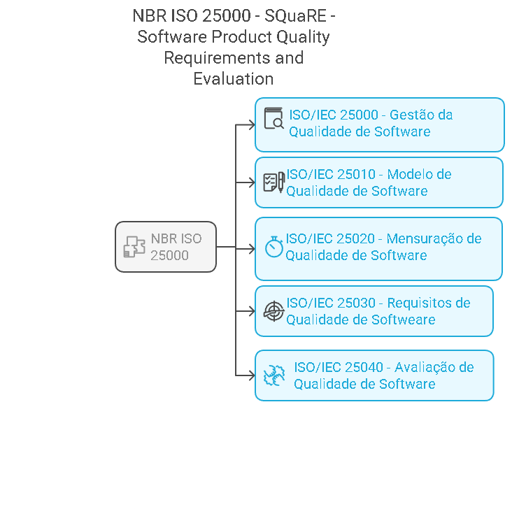

## Exercício de Fixação:

+---------------------------------------------------------------------------------------------------------------------+
| TESTE 1                                                                                                             |
+=====================================================================================================================+
| **Qual das seguintes alternativas melhor descreve o conceito de qualidade, de acordo com a definição apresentada?** |
+---------------------------------------------------------------------------------------------------------------------+
| a)  Qualidade é a ausência de defeitos em um produto ou serviço.                                                    |
+---------------------------------------------------------------------------------------------------------------------+
| b)  Qualidade é o grau em que um produto ou serviço excede as expectativas do cliente.                              |
+---------------------------------------------------------------------------------------------------------------------+
| c)  Qualidade é o grau em que um conjunto de características inerentes de um objeto satisfaz requisitos.            |
+---------------------------------------------------------------------------------------------------------------------+
| d)  Qualidade é a conformidade com as normas e regulamentos estabelecidos.                                          |
+---------------------------------------------------------------------------------------------------------------------+
| e)  Qualidade é a capacidade de um produto ou serviço ser produzido em grande quantidade.                           |
+---------------------------------------------------------------------------------------------------------------------+

+------------------------------------------------------------------------------------------------------------------------------------------------------+
| TESTE 2                                                                                                                                              |
+======================================================================================================================================================+
| **Qual das seguintes alternativas melhor descreve o conceito de Compliance?**                                                                        |
+------------------------------------------------------------------------------------------------------------------------------------------------------+
| a)  Compliance é um conjunto de estratégias de marketing para aumentar a visibilidade da empresa.                                                    |
+------------------------------------------------------------------------------------------------------------------------------------------------------+
| b)  Compliance é um sistema de gestão financeira para otimizar os lucros da empresa.                                                                 |
+------------------------------------------------------------------------------------------------------------------------------------------------------+
| c)  Compliance é o conjunto de normas, procedimentos e práticas para cumprir legislação e padrões éticos, visando segurança e minimização de riscos. |
+------------------------------------------------------------------------------------------------------------------------------------------------------+
| d)  Compliance é um programa de treinamento para melhorar o desempenho dos funcionários.                                                             |
+------------------------------------------------------------------------------------------------------------------------------------------------------+
| e)  Compliance é uma ferramenta de análise de mercado para identificar oportunidades de negócio.                                                     |
+------------------------------------------------------------------------------------------------------------------------------------------------------+

+----------------------------------------------------------------------------------------------------------------------------------------------------+
| TESTE 3                                                                                                                                            |
+====================================================================================================================================================+
| **Qual das seguintes alternativas melhor descreve o conceito de qualidade aplicada ao produto?**                                                   |
+----------------------------------------------------------------------------------------------------------------------------------------------------+
| a)  Qualidade do produto é a capacidade de um produto ser vendido a um preço baixo.                                                                |
+----------------------------------------------------------------------------------------------------------------------------------------------------+
| b)  Qualidade do produto é o grau em que um produto atende às expectativas do cliente em relação às suas características inerentes e o desempenho. |
+----------------------------------------------------------------------------------------------------------------------------------------------------+
| c)  Qualidade do produto é a quantidade de produtos produzidos em um determinado período de tempo.                                                 |
+----------------------------------------------------------------------------------------------------------------------------------------------------+
| d)  Qualidade do produto é a aparência estética de um produto, independentemente de sua funcionalidade.                                            |
+----------------------------------------------------------------------------------------------------------------------------------------------------+
| e)  Qualidade do produto é a capacidade de um produto ser facilmente descartado após o uso.                                                        |
+----------------------------------------------------------------------------------------------------------------------------------------------------+

+-------------------------------------------------------------------------------------------------------------------------------------------------+
| TESTE 4                                                                                                                                         |
+=================================================================================================================================================+
| **Qual das seguintes alternativas melhor descreve o conceito de qualidade aplicada ao processo?**                                               |
+-------------------------------------------------------------------------------------------------------------------------------------------------+
| a)  Qualidade no processo se refere à inspeção final do produto para garantir que ele esteja livre de defeitos.                                 |
+-------------------------------------------------------------------------------------------------------------------------------------------------+
| b)  Qualidade no processo é a capacidade de um processo produzir resultados consistentes e previsíveis, atendendo aos requisitos estabelecidos. |
+-------------------------------------------------------------------------------------------------------------------------------------------------+
| c)  Qualidade no processo é a utilização de materiais de alta qualidade na fabricação do produto.                                               |
+-------------------------------------------------------------------------------------------------------------------------------------------------+
| d)  Qualidade no processo é a implementação de um sistema de gestão da qualidade certificado, como a ISO 9001.                                  |
+-------------------------------------------------------------------------------------------------------------------------------------------------+
| e)  Qualidade no processo é a satisfação do cliente com o produto final, independentemente de como ele foi produzido.                           |
+-------------------------------------------------------------------------------------------------------------------------------------------------+

+---------------------------------------------------------------------------------------------------------------------------------------------------------------------+
| TESTE 5                                                                                                                                                             |
+=====================================================================================================================================================================+
| **Quais das alternativas melhor reflete principais resultados do controle de qualidade aplicado ao produto?**                                                       |
+---------------------------------------------------------------------------------------------------------------------------------------------------------------------+
| a)  Aumento no grau das características e funcionalidades do produto, aumento no grau de desempenho do produto e aumento no grau de nível de satisfação do cliente. |
+---------------------------------------------------------------------------------------------------------------------------------------------------------------------+
| b)  Redução de custos de produção, aumento da eficiência dos processos e diminuição do tempo de entrega.                                                            |
+---------------------------------------------------------------------------------------------------------------------------------------------------------------------+
| c)  Melhoria na imagem da empresa, aumento da participação de mercado e expansão para novos mercados.                                                               |
+---------------------------------------------------------------------------------------------------------------------------------------------------------------------+
| d)  Padronização dos produtos, simplificação dos processos de fabricação e redução do desperdício de materiais.                                                     |
+---------------------------------------------------------------------------------------------------------------------------------------------------------------------+
| e)  Maior flexibilidade na produção, personalização dos produtos e aumento da variedade de produtos oferecidos.                                                     |
+---------------------------------------------------------------------------------------------------------------------------------------------------------------------+

+--------------------------------------------------------------------------------------------------------------------------------------------------------------------+
| TESTE 6                                                                                                                                                            |
+====================================================================================================================================================================+
| **Qual era o principal objetivo da família de normas ISO/NBR 9126?**                                                                                               |
+--------------------------------------------------------------------------------------------------------------------------------------------------------------------+
| a) Definir padrões para a gestão de projetos de software.                                                                                                          |
+--------------------------------------------------------------------------------------------------------------------------------------------------------------------+
| b) Estabelecer diretrizes para a segurança da informação em sistemas de software.                                                                                  |
+--------------------------------------------------------------------------------------------------------------------------------------------------------------------+
| c) Padronizar a documentação de software e os processos de desenvolvimento.                                                                                        |
+--------------------------------------------------------------------------------------------------------------------------------------------------------------------+
| d) Promover a interoperabilidade entre diferentes sistemas de software.                                                                                            |
+--------------------------------------------------------------------------------------------------------------------------------------------------------------------+
| e) Padronizar a avaliação da qualidade de produtos de software, definindo parâmetros para essa avaliação dentro do modelo de qualidade das normas da família 9000. |
+--------------------------------------------------------------------------------------------------------------------------------------------------------------------+

### Repostas dos testes

| Teste | Alternativa Correta |
|-------|:-------------------:|
| 01    |          c          |
| 02    |          c          |
| 03    |          b          |
| 04    |          b          |
| 05    |          a          |
| 06    |          e          |
| 07    |                     |
| 08    |                     |
| 09    |                     |
| 10    |                     |
