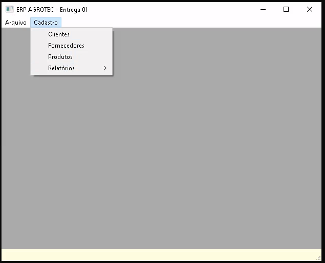
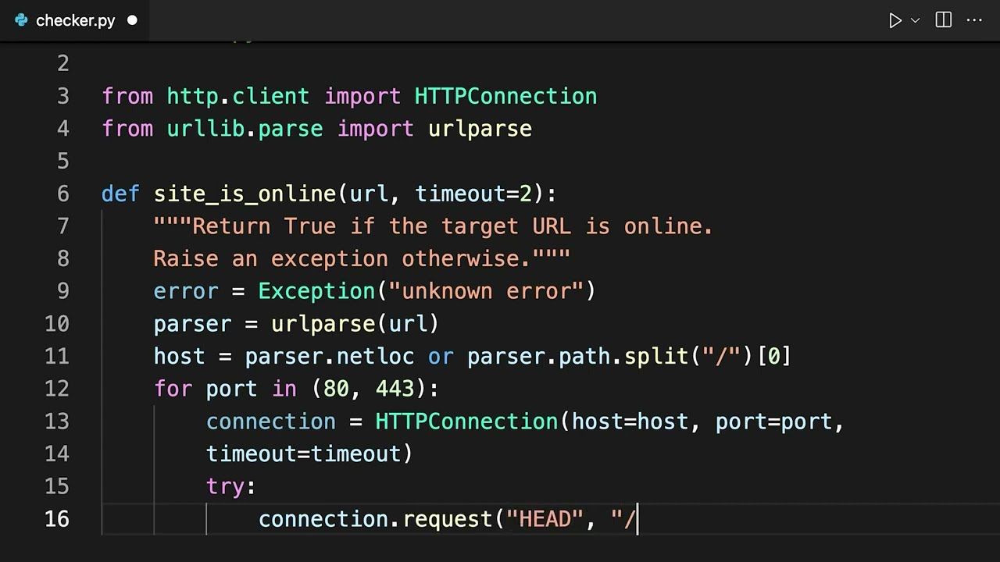
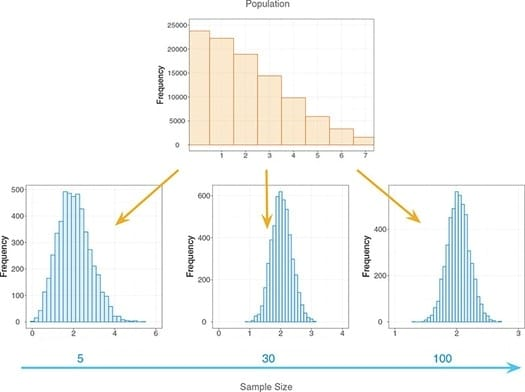

# Verificação de Validação de Software

Conforme sabemos existem quatro **atividades** fundamentais no **processo de engenharia de software**. Estas atividades podem ser organizadas de diferentes maneiras dependendo do processo de desenvolvimento utilizado. A seguinte tabela resume as atividades do processo de software de acordo com Sommerville:

+---------------------------------------+----------------------------------------------------------------------------------------------------------------------------------+
| Atividade do Processo de Software     | Descrição                                                                                                                        |
+=======================================+==================================================================================================================================+
| *Especificação de Software*           | *A funcionalidade do software e as restrições ao seu funcionamento devem ser definidas.*                                         |
+---------------------------------------+----------------------------------------------------------------------------------------------------------------------------------+
| *Projeto e Implementação de Software* | *O software deve ser produzido para atender às especificações.*                                                                  |
+---------------------------------------+----------------------------------------------------------------------------------------------------------------------------------+
| **Validação de Software**             | **O software deve ser validado para garantir que atenda às demandas do cliente.**                                                |
+---------------------------------------+----------------------------------------------------------------------------------------------------------------------------------+
| *Evolução de Software*                | *O software deve evoluir para atender às necessidades de mudança dos clientes. Alterações no software são uma parte inevitável.* |
+---------------------------------------+----------------------------------------------------------------------------------------------------------------------------------+

Hoje vamos explorar a terceira etapa, mas especificamente a *Verificação e Validação de Software*.

## Verificação de Software:

> **Definição de Verificação de Software**: *Assegurar que o software implementa corretamente uma função específica. "Estamos criando o produto corretamente?*".

## Validação de Software:

> **Definição de Validação de Software**: *Assegurar que o software foi criado e pode ser rastreado segundo os requisitos do cliente. "Estamos criando o produto certo?". Validação tem sucesso quando o software funciona de uma maneira que pode ser razoavelmente esperada pelo cliente.*

Quais os objetivos globais da etapa de Verificação e Validação de Software ?

+--------------------------------------------------------------------------------------+
| Objetivos Globais - Etapa de Verificação e Validação do Processo de Software         |
+======================================================================================+
| 1)  Conscientizar sobre a importância da V&V para a qualidade do software produzido. |
+--------------------------------------------------------------------------------------+
| 2)  Identificar erros precocemente.                                                  |
+--------------------------------------------------------------------------------------+
| 3)  Reduzir os custos de desenvolvimento do software.                                |
+--------------------------------------------------------------------------------------+
| 4)  Assegurar que o software atenda aos requisitos do cliente.                       |
+--------------------------------------------------------------------------------------+

## Classificação das Técnicas de Avaliação do Software:

As técnicas de Avaliação de Software podem ser **estáticas** ou **dinâmicas**. Ambas sem complementam e o ideal é que ambas abordagens sejam aplicadas na avaliação do produto.

## Técnicas Estáticas

As Técnicas Estáticas são Inspeções e revisões que analisam os requisitos do sistema, modelos de projeto e o código-fonte do programa sem executá-lo. O objetivo dessas técnicas é identificar erros, inconsistências, ambiguidades e desvios de padrões e requisitos em um estágio inicial do ciclo de vida do desenvolvimento de software. Os 4 tipos de técnicas estáticas mais comuns são:

+-----------------------------------------+
| a) Revisões Técnicas                    |
+-----------------------------------------+
| b) Inspeções                            |
+-----------------------------------------+
| c) Análise Estática                     |
+-----------------------------------------+
| d) Verificação Formal e Métodos Formais |
+-----------------------------------------+

: Os tipos de TÉCNICAS ESTÁTICAS

#### A) Revisões Técnicas

São atividades de controle de qualidade realizadas por engenheiros de software para descobrir erros na função, lógica ou implementação do software.

Podem ser **Informais** (sem a necessidade de agendamento ou declaração oficial ) ou **formais** ( com planilhas, documentação e acordos de compromisso).

#### Passeio (Walkthrough) ( caso especial de revisão técnica formal)

{width="281"}

Existe uma revisão técnica formal chamada "Passeio" onde o **produtor** "repassa" o artefato de software, explicando o material, enquanto os **revisores** levantam questões com base em sua preparação prévia.

#### B) Inspeção do produto

{width="331"}

Na Inspeção do Produto de software, uma **pequena equipe** verifica o código sistematicamente, procurando por possíveis erros e omissões. Tudo é executado e controlado minuciosamente com **planilhas** e **documentos de formalização** assinados pelos gestores das áreas.

#### C) Análise Estática

{width="372"}

Inspeciona-se o código fonte do programa **sem executa-lo**, procurando erros de programação "na raça".

#### D) Verificação Formal do Produto e Métodos Formais

{width="263"}

Utiliza-se **métodos matemáticos e estatísticos** para avaliar o programa. Usado em software de missão crítica como software supervisório de usinas nucleares, cirurgia robótica e software de navegação de aviação.

## Técnicas Dinâmicas

As Técnicas Dinâmicas são **testes de software**, nos quais o sistema é executado com dados de testes simulados.

+-----------------------------------+--------------------------------------------------------------------------------------------------------------------------------------------------------------------------------------------------------------------------------------------------------------------------------------------------------------+
| Tipo de Teste                     | Descrição                                                                                                                                                                                                                                                                                                    |
+:=================================:+==============================================================================================================================================================================================================================================================================================================+
| [Teste de Unidade]{.underline}    | Concentra-se em **testar componentes individuais do software**, como módulos, classes ou funções, de forma isolada. O objetivo é verificar se cada unidade funciona corretamente em relação à sua especificação. Em um contexto orientado a objetos, isso inclui o teste de métodos dentro de uma classe.    |
+-----------------------------------+--------------------------------------------------------------------------------------------------------------------------------------------------------------------------------------------------------------------------------------------------------------------------------------------------------------+
| [Teste de Integração]{.underline} | Após o teste de unidade, os **componentes são combinados e testados** em conjunto para **verificar as interações entre eles**. O teste de integração visa descobrir erros nas interfaces e na colaboração entre os módulos.                                                                                  |
+-----------------------------------+--------------------------------------------------------------------------------------------------------------------------------------------------------------------------------------------------------------------------------------------------------------------------------------------------------------+
| [Teste de Validação]{.underline}  | Tem como objetivo **garantir que o software construído atende às expectativas e aos requisitos do cliente**. Os critérios de teste de validação são estabelecidos durante a análise de requisitos.                                                                                                           |
+-----------------------------------+--------------------------------------------------------------------------------------------------------------------------------------------------------------------------------------------------------------------------------------------------------------------------------------------------------------+
| [Teste de Sistema]{.underline}    | Testa o **software como um sistema completo**, após a integração de todos os componentes.                                                                                                                                                                                                                    |
+-----------------------------------+--------------------------------------------------------------------------------------------------------------------------------------------------------------------------------------------------------------------------------------------------------------------------------------------------------------+

O teste de sistema pode ser separado em 6 subtestes:

+:-------------------------------------------------------------------:+---------------------------------------------------------------------------------------------------------------------------------------------------------------------------------------------------------------------------------+
| [Teste de Recuperação]{.underline}                                  | Verifica a capacidade do sistema de se **recuperar de falhas** (software ou hardware) e continuar operando corretamente.                                                                                                        |
+---------------------------------------------------------------------+---------------------------------------------------------------------------------------------------------------------------------------------------------------------------------------------------------------------------------+
| [Teste de Segurança]{.underline}                                    | Avalia se o sistema **protege dados e funcionalidades contra acessos não autorizados** e se cumpre os requisitos de privacidade e segurança.                                                                                    |
+---------------------------------------------------------------------+---------------------------------------------------------------------------------------------------------------------------------------------------------------------------------------------------------------------------------+
| [Teste por Esforço]{.underline}                                     | Examina o comportamento do sistema sob **condições de carga anormal** (volume de dados, número de usuários, etc.) para identificar seus limites e possíveis pontos de falha.                                                    |
+---------------------------------------------------------------------+---------------------------------------------------------------------------------------------------------------------------------------------------------------------------------------------------------------------------------+
| [Teste de Desempenho]{.underline}                                   | Avalia os **aspectos de desempenho do sistema**, como tempo de resposta, vazão e utilização de recursos, sob condições normais e de carga.                                                                                      |
+---------------------------------------------------------------------+---------------------------------------------------------------------------------------------------------------------------------------------------------------------------------------------------------------------------------+
| [Teste de Disponibilização (Implantação/Configuração)]{.underline}  | Verifica se o software **opera corretamente em todos os ambientes** (plataformas, sistemas operacionais) para os quais foi projetado. Inclui também a avaliação dos procedimentos de instalação e da documentação associada.    |
+---------------------------------------------------------------------+---------------------------------------------------------------------------------------------------------------------------------------------------------------------------------------------------------------------------------+
| [Teste de Regressão]{.underline}                                    | É realizado após **alterações no software** (correção de erros, adição de novas funcionalidades) para garantir que as modificações não introduziram novos defeitos ou afetaram adversamente as partes existentes do sistema.    |
+---------------------------------------------------------------------+---------------------------------------------------------------------------------------------------------------------------------------------------------------------------------------------------------------------------------+

A escolha das técnicas dinâmicas e dos tipos de testes a serem utilizados depende do **tipo de software a ser desenvolvido**, dos **requisitos do projeto**, dos **recursos disponíveis** e dos **riscos envolvidos**. O objetivo final é **encontrar o maior número possível de erros** com o mínimo de esforço e garantir a entrega de software de alta qualidade que atenda às necessidades dos usuários.
