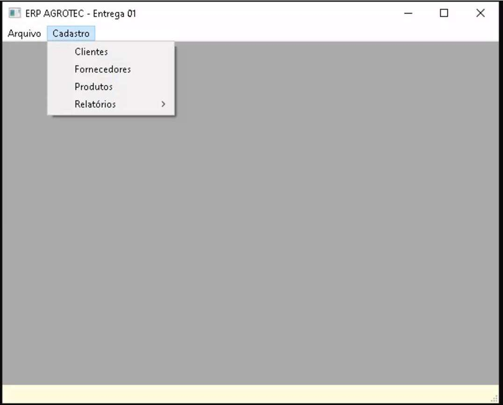
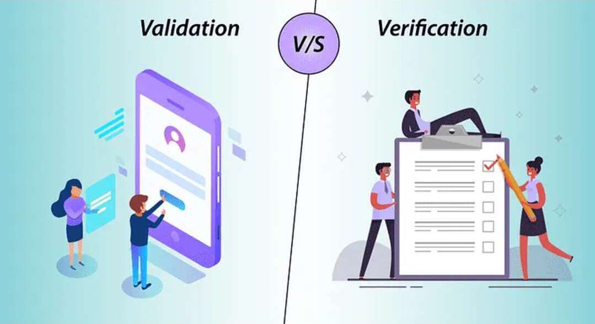
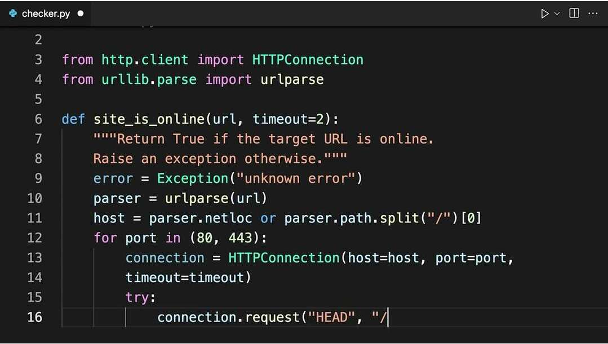
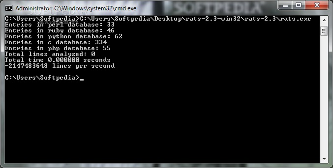
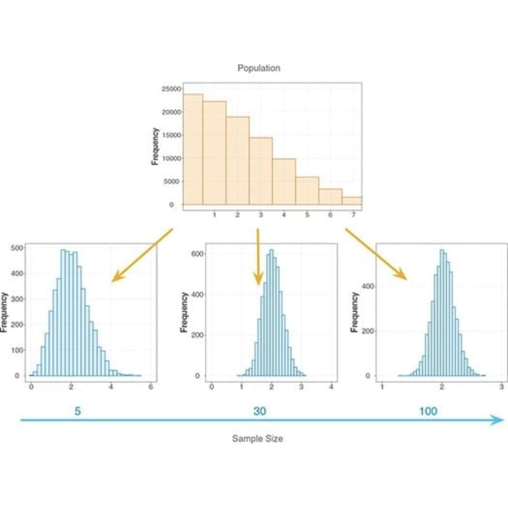

# Verificação de Validação de Software

Conforme sabemos existem quatro **atividades** fundamentais no **processo de engenharia de software**. Estas atividades podem ser organizadas de diferentes maneiras dependendo do processo de desenvolvimento utilizado. A seguinte tabela resume as atividades do processo de software de acordo com Sommerville:

+---------------------------------------+----------------------------------------------------------------------------------------------------------------------------------+
| Atividade do Processo de Software     | Descrição                                                                                                                        |
+=======================================+==================================================================================================================================+
| *Especificação de Software*           | *A funcionalidade do software e as restrições ao seu funcionamento devem ser definidas.*                                         |
+---------------------------------------+----------------------------------------------------------------------------------------------------------------------------------+
| *Projeto e Implementação de Software* | *O software deve ser produzido para atender às especificações.*                                                                  |
+---------------------------------------+----------------------------------------------------------------------------------------------------------------------------------+
| **Validação de Software**             | **O software deve ser validado para garantir que atenda às demandas do cliente.**                                                |
+---------------------------------------+----------------------------------------------------------------------------------------------------------------------------------+
| *Evolução de Software*                | *O software deve evoluir para atender às necessidades de mudança dos clientes. Alterações no software são uma parte inevitável.* |
+---------------------------------------+----------------------------------------------------------------------------------------------------------------------------------+

Hoje vamos explorar a terceira etapa, mas especificamente a *Verificação e Validação de Software*.

## Verificação de Software:

> **Definição de Verificação de Software**: *Assegurar que o software implementa corretamente uma função específica. "Estamos criando o produto corretamente?*".

## Validação de Software:

> **Definição de Validação de Software**: *Assegurar que o software foi criado e pode ser rastreado segundo os requisitos do cliente. "Estamos criando o produto certo?". Validação tem sucesso quando o software funciona de uma maneira que pode ser razoavelmente esperada pelo cliente.*

Quais os objetivos globais da etapa de Verificação e Validação de Software ?

+--------------------------------------------------------------------------------------+
| Objetivos Globais - Etapa de Verificação e Validação do Processo de Software         |
+======================================================================================+
| 1)  Conscientizar sobre a importância da V&V para a qualidade do software produzido. |
+--------------------------------------------------------------------------------------+
| 2)  Identificar erros precocemente.                                                  |
+--------------------------------------------------------------------------------------+
| 3)  Reduzir os custos de desenvolvimento do software.                                |
+--------------------------------------------------------------------------------------+
| 4)  Assegurar que o software atenda aos requisitos do cliente.                       |
+--------------------------------------------------------------------------------------+

## Classificação das Técnicas de Verificação e Validação:

Para garantir a Qualidade do Software, a abordagem das técnicas de Verificação e Validação de software podem ser organizadas em dois grandes grupos principais:

-   **Técnicas Estáticas de Verificação e Validação de software**;

-   **Técnicas** **Dinâmicas de Verificação e Validação de software**;

Ambas sem complementam e o ideal é que ambas abordagens sejam aplicadas na avaliação do produto.

## Verificação e Validação de software por Técnicas Estáticas

As Técnicas Estáticas são Inspeções e revisões que analisam os requisitos do sistema, modelos de projeto e o código-fonte do programa sem executá-lo. O objetivo dessas técnicas é identificar erros, inconsistências, ambiguidades e desvios de padrões e requisitos em um estágio inicial do ciclo de vida do desenvolvimento de software. Os 4 tipos de técnicas estáticas mais comuns são:

+------------------------------------------+
| a)  Revisões Técnicas                    |
+------------------------------------------+
| b)  Inspeções                            |
+------------------------------------------+
| c)  Análise Estática                     |
+------------------------------------------+
| d)  Verificação Formal e Métodos Formais |
+------------------------------------------+

: Os tipos de TÉCNICAS ESTÁTICAS

#### A) Revisões Técnicas

São atividades de controle de qualidade realizadas por engenheiros de software para descobrir erros na função, lógica ou implementação do software.

Podem ser **Informais** (sem a necessidade de agendamento ou declaração oficial ) ou **formais** ( com planilhas, documentação e acordos de compromisso).

#### Passeio (Walkthrough) ( caso especial de revisão técnica formal)

Existe uma revisão técnica formal chamada "Passeio" onde o **produtor** "repassa" o artefato de software, explicando o material, enquanto os **revisores** levantam questões com base em sua preparação prévia.

#### B) Inspeção do produto

Na Inspeção do Produto de software, uma **pequena equipe** verifica o código sistematicamente, procurando por possíveis erros e omissões. Tudo é executado e controlado minuciosamente com **planilhas** e **documentos de formalização** assinados pelos gestores das áreas.

#### C) Análise Estática

{width="372"}

Inspeciona-se o código fonte do programa **sem executa-lo**, procurando erros de programação "na raça".

#### D) Análise Estática Automatizada

Inspeciona-se o código fonte do programa **com auxílio de um programa**, como por exemplo o [RATS (Rough Auditing Tool for Security)](https://www.security-database.com/toolswatch/RATS-v2-3-Rough-Auditing-Tool-for.html) que significa "Ferramenta de auditoria bruta para segurança".

#### E) Verificação Formal do Produto e Métodos Formais

Utiliza-se **métodos matemáticos e estatísticos** para avaliar o programa. Usado em software de missão crítica como software supervisório de usinas nucleares, cirurgia robótica e software de navegação de aviação.

## Verificação e Validação de software por Técnicas Dinâmicas

As Técnicas Dinâmicas são **testes de software**, nos quais o sistema é executado com dados de testes simulados.

+-----------------------------------+-----------------------------------------------------------------------------------------------------------------------------------------------------------------------------------------------------------------------------------------------------------------------------------------------------------+
| Tipo de Teste                     | Descrição                                                                                                                                                                                                                                                                                                 |
+:=================================:+===========================================================================================================================================================================================================================================================================================================+
| [Teste de Unidade]{.underline}    | Concentra-se em **testar componentes individuais do software**, como módulos, classes ou funções, de forma isolada. O objetivo é verificar se cada unidade funciona corretamente em relação à sua especificação. Em um contexto orientado a objetos, isso inclui o teste de métodos dentro de uma classe. |
+-----------------------------------+-----------------------------------------------------------------------------------------------------------------------------------------------------------------------------------------------------------------------------------------------------------------------------------------------------------+
| [Teste de Integração]{.underline} | Após o teste de unidade, os **componentes são combinados e testados** em conjunto para **verificar as interações entre eles**. O teste de integração visa descobrir erros nas interfaces e na colaboração entre os módulos.                                                                               |
+-----------------------------------+-----------------------------------------------------------------------------------------------------------------------------------------------------------------------------------------------------------------------------------------------------------------------------------------------------------+
| [Teste de Validação]{.underline}  | Tem como objetivo **garantir que o software construído atende às expectativas e aos requisitos do cliente**. Os critérios de teste de validação são estabelecidos durante a análise de requisitos.                                                                                                        |
+-----------------------------------+-----------------------------------------------------------------------------------------------------------------------------------------------------------------------------------------------------------------------------------------------------------------------------------------------------------+
| [Teste de Sistema]{.underline}    | Testa o **software como um sistema completo**, após a integração de todos os componentes.                                                                                                                                                                                                                 |
+-----------------------------------+-----------------------------------------------------------------------------------------------------------------------------------------------------------------------------------------------------------------------------------------------------------------------------------------------------------+

O teste de sistema pode ser separado em 6 subtestes:

+:------------------------------------------------------------------:+------------------------------------------------------------------------------------------------------------------------------------------------------------------------------------------------------------------------------+
| [Teste de Recuperação]{.underline}                                 | Verifica a capacidade do sistema de se **recuperar de falhas** (software ou hardware) e continuar operando corretamente.                                                                                                     |
+--------------------------------------------------------------------+------------------------------------------------------------------------------------------------------------------------------------------------------------------------------------------------------------------------------+
| [Teste de Segurança]{.underline}                                   | Avalia se o sistema **protege dados e funcionalidades contra acessos não autorizados** e se cumpre os requisitos de privacidade e segurança.                                                                                 |
+--------------------------------------------------------------------+------------------------------------------------------------------------------------------------------------------------------------------------------------------------------------------------------------------------------+
| [Teste por Esforço]{.underline}                                    | Examina o comportamento do sistema sob **condições de carga anormal** (volume de dados, número de usuários, etc.) para identificar seus limites e possíveis pontos de falha.                                                 |
+--------------------------------------------------------------------+------------------------------------------------------------------------------------------------------------------------------------------------------------------------------------------------------------------------------+
| [Teste de Desempenho]{.underline}                                  | Avalia os **aspectos de desempenho do sistema**, como tempo de resposta, vazão e utilização de recursos, sob condições normais e de carga.                                                                                   |
+--------------------------------------------------------------------+------------------------------------------------------------------------------------------------------------------------------------------------------------------------------------------------------------------------------+
| [Teste de Disponibilização (Implantação/Configuração)]{.underline} | Verifica se o software **opera corretamente em todos os ambientes** (plataformas, sistemas operacionais) para os quais foi projetado. Inclui também a avaliação dos procedimentos de instalação e da documentação associada. |
+--------------------------------------------------------------------+------------------------------------------------------------------------------------------------------------------------------------------------------------------------------------------------------------------------------+
| [Teste de Regressão]{.underline}                                   | É realizado após **alterações no software** (correção de erros, adição de novas funcionalidades) para garantir que as modificações não introduziram novos defeitos ou afetaram adversamente as partes existentes do sistema. |
+--------------------------------------------------------------------+------------------------------------------------------------------------------------------------------------------------------------------------------------------------------------------------------------------------------+

A escolha das técnicas dinâmicas e dos tipos de testes a serem utilizados depende do **tipo de software a ser desenvolvido**, dos **requisitos do projeto**, dos **recursos disponíveis** e dos **riscos envolvidos**. O objetivo final é **encontrar o maior número possível de erros** com o mínimo de esforço e garantir a entrega de software de alta qualidade que atenda às necessidades dos usuários.

## Exercícios

### Testes Sobre Verificação e Validação I

+--------------------------------------------------------------------------------------------------------------------------------------+
| **TESTE 1**                                                                                                                          |
+======================================================================================================================================+
| Qual das seguintes afirmações melhor descreve o conceito de **verificação de software**?                                             |
+--------------------------------------------------------------------------------------------------------------------------------------+
| A)  É o processo de testar o software no ambiente do usuário final para garantir que ele atenda às suas necessidades e expectativas. |
+--------------------------------------------------------------------------------------------------------------------------------------+
| B)  Refere-se ao conjunto de atividades que visam descobrir erros e defeitos no software antes que ele seja entregue.                |
+--------------------------------------------------------------------------------------------------------------------------------------+
| C)  Consiste em garantir que o software construído implementa corretamente as funcionalidades e requisitos especificados.            |
+--------------------------------------------------------------------------------------------------------------------------------------+
| D)  Envolve a avaliação do desempenho do software em diferentes condições de carga e estresse para identificar gargalos.             |
+--------------------------------------------------------------------------------------------------------------------------------------+
| E)  É a prática de gerenciar e controlar as mudanças feitas no software ao longo do seu ciclo de vida.                               |
+--------------------------------------------------------------------------------------------------------------------------------------+

+-----------------------------------------------------------------------------------------------------------------------------------------------------------------+
| **TESTE 2**                                                                                                                                                     |
+=================================================================================================================================================================+
| Qual das seguintes afirmações melhor descreve o conceito de **validação de software**?                                                                          |
+-----------------------------------------------------------------------------------------------------------------------------------------------------------------+
| A)  É o processo de confirmar se o software está livre de defeitos através da execução de diversos casos de teste que cobrem o código em sua totalidade.        |
+-----------------------------------------------------------------------------------------------------------------------------------------------------------------+
| B)  Refere-se ao conjunto de atividades que garantem que o software foi construído corretamente, ou seja, em conformidade com as especificações de requisitos.  |
+-----------------------------------------------------------------------------------------------------------------------------------------------------------------+
| C)  Envolve a análise estática do código-fonte para identificar potenciais vulnerabilidades de segurança e garantir a conformidade com padrões de codificação.  |
+-----------------------------------------------------------------------------------------------------------------------------------------------------------------+
| D)  É a prática de documentar o design do software e garantir que a implementação esteja alinhada com a arquitetura definida.                                   |
+-----------------------------------------------------------------------------------------------------------------------------------------------------------------+
| E)  Consiste em avaliar se o software atende às necessidades e expectativas do cliente e dos usuários finais, assegurando que o "produto certo" foi construído. |
+-----------------------------------------------------------------------------------------------------------------------------------------------------------------+

+----------------------------------------------------------------------------------------------------------------------------------------------------------------------------------------------------------------------------------------------------------------------------------------------------------------------------------------------------------------+
| **TESTE 3**                                                                                                                                                                                                                                                                                                                                                    |
+================================================================================================================================================================================================================================================================================================================================================================+
| Qual das seguintes afirmações descreve melhor a técnica de "**Walkthrough**" (passeio) no contexto de Verificação e Validação de software?                                                                                                                                                                                                                     |
+----------------------------------------------------------------------------------------------------------------------------------------------------------------------------------------------------------------------------------------------------------------------------------------------------------------------------------------------------------------+
| A)  É uma técnica **dinâmica** que envolve a execução do software com dados de teste para observar seu comportamento e identificar defeitos em tempo de execução.                                                                                                                                                                                              |
+----------------------------------------------------------------------------------------------------------------------------------------------------------------------------------------------------------------------------------------------------------------------------------------------------------------------------------------------------------------+
| B)  Refere-se à aplicação de **métodos formais** que utilizam notação matemática para especificar e verificar as propriedades do software.                                                                                                                                                                                                                     |
+----------------------------------------------------------------------------------------------------------------------------------------------------------------------------------------------------------------------------------------------------------------------------------------------------------------------------------------------------------------+
| C)  Consiste na utilização de **testes automatizados** e ferramentas específicas para executar um grande número de casos de teste e verificar os resultados em relação às expectativas.                                                                                                                                                                        |
+----------------------------------------------------------------------------------------------------------------------------------------------------------------------------------------------------------------------------------------------------------------------------------------------------------------------------------------------------------------+
| D)  Trata-se de uma **revisão técnica informal** ou **passeio informal** realizado com colegas, onde um produto de software (como um documento de requisitos, um projeto ou um trecho de código) é examinado passo a passo por um grupo para identificar possíveis erros, inconsistências, ou áreas que precisam de melhorias, **sem a execução do software**. |
+----------------------------------------------------------------------------------------------------------------------------------------------------------------------------------------------------------------------------------------------------------------------------------------------------------------------------------------------------------------+
| E)  Envolve a condução de **testes de aceitação pelo usuário** em um ambiente operacional para determinar se o software atende às necessidades do cliente e está pronto para ser implantado.                                                                                                                                                                   |
+----------------------------------------------------------------------------------------------------------------------------------------------------------------------------------------------------------------------------------------------------------------------------------------------------------------------------------------------------------------+

+-----------------------------------------------------------------------------------------------------------------------------------+
| **TESTE 4**                                                                                                                       |
+===================================================================================================================================+
| Qual das seguintes opções lista os tipos mais comuns de **técnicas estáticas** utilizadas em Verificação e Validação de software? |
+-----------------------------------------------------------------------------------------------------------------------------------+
| A)  Revisões técnicas (incluindo inspeções e walkthroughs) e análise estática automatizada.                                       |
+-----------------------------------------------------------------------------------------------------------------------------------+
| B)  Testes de unidade, testes de integração e testes de sistema.                                                                  |
+-----------------------------------------------------------------------------------------------------------------------------------+
| C)  Testes alfa, testes beta e testes de aceitação pelo usuário.                                                                  |
+-----------------------------------------------------------------------------------------------------------------------------------+
| D)  Testes de desempenho, testes de segurança e testes de carga.                                                                  |
+-----------------------------------------------------------------------------------------------------------------------------------+
| E)  Depuração, teste de regressão e teste de fumaça.                                                                              |
+-----------------------------------------------------------------------------------------------------------------------------------+

+---------------------------------------------------------------------------------------------------------+
| TESTE 5                                                                                                 |
+=========================================================================================================+
| Quem geralmente participa de uma inspeção formal de software (revisão técnica formal)?                  |
+---------------------------------------------------------------------------------------------------------+
| A)  Apenas os desenvolvedores responsáveis pela criação do artefato inspecionado.                       |
+---------------------------------------------------------------------------------------------------------+
| B)  Uma equipe composta por diferentes papéis, como moderador, inspetor, relator e o autor do artefato. |
+---------------------------------------------------------------------------------------------------------+
| C)  Somente os gerentes de projeto para avaliar o progresso e a conformidade com o cronograma.          |
+---------------------------------------------------------------------------------------------------------+
| D)  Exclusivamente os especialistas em testes para planejar os casos de teste futuros.                  |
+---------------------------------------------------------------------------------------------------------+
| E)  Apenas o cliente para garantir que os requisitos foram atendidos.                                   |
+---------------------------------------------------------------------------------------------------------+

+-------------------------------------------------------------------------------------------------------------------------------+
| TESTE 6                                                                                                                       |
+===============================================================================================================================+
| Qual a principal característica que distingue a verificação formal de outras técnicas de verificação e validação de software? |
+-------------------------------------------------------------------------------------------------------------------------------+
| A)  A sua aplicação durante a fase de testes de unidade e integração.                                                         |
+-------------------------------------------------------------------------------------------------------------------------------+
| B)  O uso de métodos matemáticos e lógicos para provar a correção do software em relação às suas especificações.              |
+-------------------------------------------------------------------------------------------------------------------------------+
| C)  A dependência da execução do software com dados de entrada reais.                                                         |
+-------------------------------------------------------------------------------------------------------------------------------+
| D)  O foco na identificação de defeitos de usabilidade na interface do usuário.                                               |
+-------------------------------------------------------------------------------------------------------------------------------+
| E)  A sua realização por uma equipe de teste independente ao final do desenvolvimento.                                        |
+-------------------------------------------------------------------------------------------------------------------------------+

+----------------------------------------------------------------------------------------------------------------+
| TESTE 7                                                                                                        |
+================================================================================================================+
| Qual o principal objetivo da aplicação de métodos formais na verificação de um produto de software?            |
+----------------------------------------------------------------------------------------------------------------+
| A)  Melhorar a comunicação entre a equipe de desenvolvimento e os stakeholders.                                |
+----------------------------------------------------------------------------------------------------------------+
| B)  Garantir que o software seja portável para diferentes plataformas de hardware.                             |
+----------------------------------------------------------------------------------------------------------------+
| C)  Reduzir o tempo e o custo total do ciclo de vida do software.                                              |
+----------------------------------------------------------------------------------------------------------------+
| D)  Aumentar o nível de confiança na correção do software, através de provas matemáticas de suas propriedades. |
+----------------------------------------------------------------------------------------------------------------+
| E)  Otimizar o desempenho do software em termos de velocidade e consumo de memória.                            |
+----------------------------------------------------------------------------------------------------------------+

+---------------------------------------------------------------------------------------------------------------------------+
| TESTE 8                                                                                                                   |
+===========================================================================================================================+
| Qual das seguintes atividades é a principal característica das técnicas dinâmicas de verificação e validação de software? |
+---------------------------------------------------------------------------------------------------------------------------+
| A) A análise estática do código-fonte em busca de possíveis defeitos.                                                     |
+---------------------------------------------------------------------------------------------------------------------------+
| B) A aplicação de métodos matemáticos para provar a correção do software.                                                 |
+---------------------------------------------------------------------------------------------------------------------------+
| C) A revisão manual da documentação do software para garantir a sua completude.                                           |
+---------------------------------------------------------------------------------------------------------------------------+
| D) A execução do software com dados de entrada para observar seu comportamento e identificar erros.                       |
+---------------------------------------------------------------------------------------------------------------------------+
| E) A inspeção formal dos artefatos de software por uma equipe multidisciplinar.                                           |
+---------------------------------------------------------------------------------------------------------------------------+

+-----------------------------------------------------------------------------------------------------------------------------------+
| TESTE 9                                                                                                                           |
+===================================================================================================================================+
| Qual o principal objetivo do teste de software como uma técnica dinâmica de verificação e validação?                              |
+-----------------------------------------------------------------------------------------------------------------------------------+
| A) Garantir que a documentação do software esteja completa e correta.                                                             |
+-----------------------------------------------------------------------------------------------------------------------------------+
| B) Otimizar o desempenho do software em termos de velocidade e consumo de recursos.                                               |
+-----------------------------------------------------------------------------------------------------------------------------------+
| C) Encontrar erros no software, demonstrar que suas funções estão funcionando conforme as especificações e validar os requisitos. |
+-----------------------------------------------------------------------------------------------------------------------------------+
| D) Verificar a conformidade do processo de desenvolvimento com os padrões estabelecidos.                                          |
+-----------------------------------------------------------------------------------------------------------------------------------+
| E) Avaliar a usabilidade da interface do usuário do software.                                                                     |
+-----------------------------------------------------------------------------------------------------------------------------------+

+--------------------------------------------------------------------------------------------------------------------------------------------------------------+
| TESTE 10                                                                                                                                                     |
+==============================================================================================================================================================+
| Qual dos seguintes níveis de teste é considerado uma técnica dinâmica de verificação e validação que foca em exercitar a menor unidade testável do software? |
+--------------------------------------------------------------------------------------------------------------------------------------------------------------+
| A) Teste de sistema.                                                                                                                                         |
+--------------------------------------------------------------------------------------------------------------------------------------------------------------+
| B) Teste de integração.                                                                                                                                      |
+--------------------------------------------------------------------------------------------------------------------------------------------------------------+
| C) Teste de validação.                                                                                                                                       |
+--------------------------------------------------------------------------------------------------------------------------------------------------------------+
| D) Teste de unidade.                                                                                                                                         |
+--------------------------------------------------------------------------------------------------------------------------------------------------------------+
| E) Teste de aceitação.                                                                                                                                       |
+--------------------------------------------------------------------------------------------------------------------------------------------------------------+

### Respostas para os Testes

| Testes   | Respostas |
|----------|-----------|
| Teste_01 | C         |
| Teste_02 | E         |
| Teste_03 | D         |
| Teste_04 | A         |
| Teste_05 | B         |
| Teste_06 | B         |
| Teste_07 | D         |
| Teste_08 | D         |
| Teste_09 | C         |
| Teste_10 | E         |
