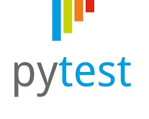
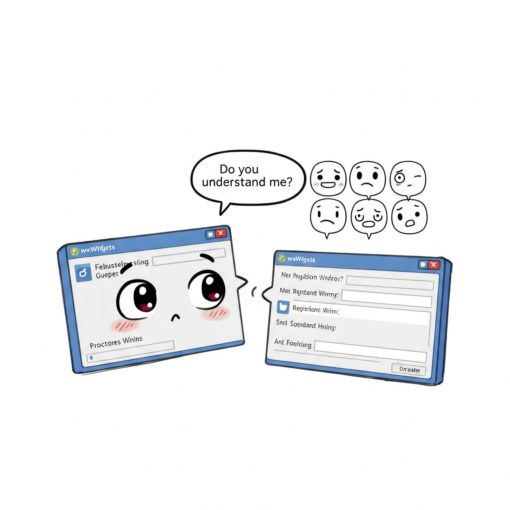
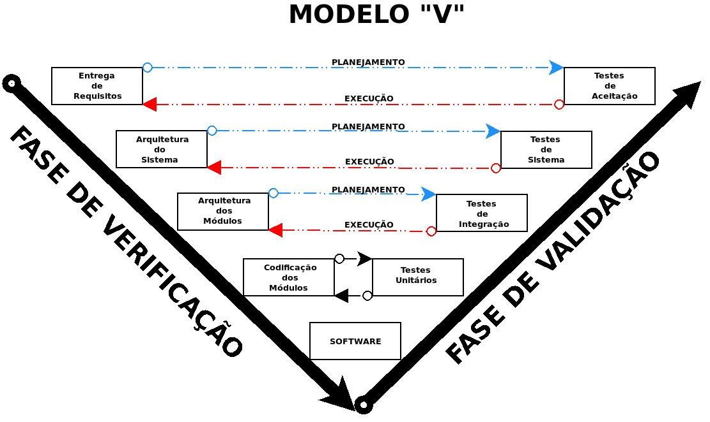

# Verificação de Validação de Software II - Continuação

## Fundamentos de Teste de Software

**O objetivo primordial do teste de software é descobrir erros**. Um bom teste é aquele que tem alta probabilidade de encontrar um erro. Como benefício secundário, os testes demonstram que as funções do software estão funcionando de acordo com as especificações e que os requisitos relativos ao desempenho e ao comportamento parecem estar sendo atingidos. Os dados coletados durante os testes fornecem um bom indício da confiabilidade e da qualidade geral do software. No entanto, é fundamental lembrar que **os testes não podem mostrar a ausência de erros e defeitos, apenas que erros e defeitos de software estão presentes**. Por isso, não se deve considerar o teste como uma "rede de segurança" que detectará todos os erros decorrentes de práticas deficientes de engenharia de software.

## Os testes e o Ciclo de Vida do Software

### Teste de Unidade ou Unitários

Focado em testar cada componente individualmente para garantir que funcione adequadamente como uma unidade.

##### Ferramentas (bibliotecas) de teste unitário das linguagens de programação mais populares e robustas

| Nome do framework de teste de unidade | Linguagem | Logotipo |
|----|----|----|
| Pytest | Python | {width="102"} |
| JUnit | Java | {width="NaN" height="NaN"} |
| CTest | C++ | {width="92"} |

#### Exemplo de Teste Unitário no Python

Vamos testar uma função chamada `soma` que faça adição de dois números `a` e `b`.

Crie um arquivo **soma.py** que contém função chamada `soma` que faça adição de dois números `a` e `b` :

Código do arquivo soma segue abaixo:

``` python

# arquivo soma.py


def soma(a, b):
    return a + b
```

Agora crie, no mesmo diretório, um arquivo cahamdo **test_soma.py** .

Esse arquivo cria a função de este testa `test_soma_positivos()` que testa a função soma `soma` passando dois números `2` e `3` para ela.

O resultado esperado é 5 :

``` python
from soma import soma

def test_soma_positivos():
    assert soma(2, 3) == 5
    
```

Então, estando os arquivos **soma.py** e **test_soma.py** no mesmo arquivo, basta executar a ferramenta **pytest**

``` cmd
============================= test session starts ==============================
platform linux -- Python 3.x.x, pytest-x.x.x, py-x.x.x, pluggy-x.x.x
rootdir: /path/to/your/directory

collected 5 items

test_soma.py .....                                                    [100%]

============================== 5 passed in 0.01s ==============================
```

A função **soma()** passou no teste unitário.

### Teste de Integração

{width="346"}

Focado em testar cada componente individualmente para garantir que funcione adequadamente como uma unidade.

### Teste de Validação

Focado em testar cada componente individualmente para garantir que funcione adequadamente como uma unidade.

### Testes de Sistema

{width="254"}

Focado em testar cada componente individualmente para garantir que funcione adequadamente como uma unidade.

## Modelo V

{width="194"}

Em Testes de Software, o **Diagrama V (ou Modelo V)** é uma variação na representação do modelo cascata (ciclo de vida clássico) que descreve a relação entre **ações de garantia da qualidade (testes)** e as **ações associadas a comunicação, modelagem e atividades de construção iniciais**. Ele oferece uma maneira de **visualizar como as ações de verificação e validação são aplicadas a um trabalho de engenharia anterior**.

Em outras palavras, o modelo V correlaciona os **testes de Verificação e Validação de Software** ao **ciclo de Vida** do processo de desenvolvimento de Software **fornecendo a noção que o software é testado em todo seu ciclo de vida**:

+:---------------------------------------------------------------------:+:-----------------------------------------------------------:+
| **Etapa do Ciclo de Vida do Processo de Desenvolvimento de Software** | **Qualidade Testes de Verificação e Validação do Software** |
+-----------------------------------------------------------------------+-------------------------------------------------------------+
| -   Elicitação de Requisitos                                          | -   Teste de aceitação                                      |
+-----------------------------------------------------------------------+-------------------------------------------------------------+
| -   Planejameno: Arquitetura do sistema                               | -   Teste de Sistema                                        |
+-----------------------------------------------------------------------+-------------------------------------------------------------+
| -   Planejameno: Arquitetura dos Módulos                              | -   Teste de Integração                                     |
+-----------------------------------------------------------------------+-------------------------------------------------------------+
| -   Codificação                                                       | -   Teste Unitário                                          |
+-----------------------------------------------------------------------+-------------------------------------------------------------+

|                     |
|:-------------------:|
| **SOFTWARE PRONTO** |

Esse correlacionamento pode ser visualizado na figura abaixo, em formato "V":

{width="800"}

## Testes Unitários

O objetivo primordial do teste unitário é **focar o esforço de verificação na menor unidade de projeto do software para descobrir erros dentro dos limites dessa unidade**. Ele busca garantir que cada parte individual do sistema funcione corretamente.

O teste unitário se concentra na **lógica interna de processamento e nas estruturas de dados dentro dos limites de um componente**. Ele examina os caminhos de controle importantes para descobrir erros na lógica do módulo.

### Testes Estruturais (Caixa-Branca)

{width="304"}

Os t**estes caixa-branca**, também chamados de teste da caixa-de-vidro ou **teste estrutural**, são uma filosofia de projeto de casos de teste que utiliza a estrutura de controle descrita como parte do projeto no nível de componentes para derivar casos de teste.

O **teste de caixa-branca se alinha com o teste unitário**. O teste caixa-branca é frequentemente aplicado a **pequenos componentes de programas (por exemplo, módulos ou pequenos grupos de módulos)**, sendo considerado um "teste no pequeno".

### Testes Funcionais (Caixa-Preta)

{width="396"}

Os **testes caixa-preta**, também chamados de **teste comportamental** ou **teste funcional**, são uma abordagem de teste que **focaliza os requisitos funcionais do software**. Diferentemente dos testes caixa-branca, que examinam a estrutura lógica interna do software, o teste caixa-preta **faz referência a testes realizados na interface do software**, com **pouca preocupação em relação à estrutura lógica interna do software**. Em vez de olhar o código-fonte, os testadores caixa-preta trabalham com a **visão externa do software**.

#### Técnicas de testes funcionais

## Exercícios

### Testes

+------------------------------------------------------------------------------------------------------------+
| TESTE 01                                                                                                   |
+============================================================================================================+
| Qual é o objetivo fundamental do Teste de Software ?                                                       |
+------------------------------------------------------------------------------------------------------------+
| a)  Otimizar o desempenho do software para garantir uma melhor experiência do usuário.                     |
+------------------------------------------------------------------------------------------------------------+
| b)  Descobrir o maior número possível de erros e defeitos no software antes de sua entrega ou implantação. |
+------------------------------------------------------------------------------------------------------------+
| c)  Validar se o software está sendo desenvolvido dentro do prazo e do orçamento estipulados.              |
+------------------------------------------------------------------------------------------------------------+
| d)  Garantir que o software seja compatível com todas as plataformas e dispositivos existentes.            |
+------------------------------------------------------------------------------------------------------------+
| e)  Documentar detalhadamente todas as funcionalidades do software para referência futura.                 |
+------------------------------------------------------------------------------------------------------------+

+--------------------------------------------------------------------------------------------------------------------------------------------+
| TESTE 02                                                                                                                                   |
+============================================================================================================================================+
| No contexto de Testes de Software, qual a distinção essencial entre **verificação e validação**?                                           |
+--------------------------------------------------------------------------------------------------------------------------------------------+
| a)  Verificação foca em testar o software em diferentes ambientes, enquanto validação se concentra na sua funcionalidade.                  |
+--------------------------------------------------------------------------------------------------------------------------------------------+
| b)  Verificação é realizada pelos desenvolvedores, e validação é feita pelos usuários finais.                                              |
+--------------------------------------------------------------------------------------------------------------------------------------------+
| c)  Verificação pergunta "Estamos construindo o produto corretamente?", enquanto validação pergunta "Estamos construindo o produto certo?" |
+--------------------------------------------------------------------------------------------------------------------------------------------+
| d)  Validação ocorre antes da verificação no ciclo de vida de desenvolvimento de software.                                                 |
+--------------------------------------------------------------------------------------------------------------------------------------------+
| e)  Ambas se referem ao mesmo conjunto de atividades de garantia da qualidade.                                                             |
+--------------------------------------------------------------------------------------------------------------------------------------------+

+---------------------------------------------------------------------------------------------------------------------------------------------------+
| TESTE 03                                                                                                                                          |
+===================================================================================================================================================+
| Qual tipo de teste de software se baseia no **exame da estrutura interna** do software, incluindo seu código-fonte, para projetar casos de teste? |
+---------------------------------------------------------------------------------------------------------------------------------------------------+
| a)  Teste de caixa-preta                                                                                                                          |
+---------------------------------------------------------------------------------------------------------------------------------------------------+
| b)  Teste de desempenho.                                                                                                                          |
+---------------------------------------------------------------------------------------------------------------------------------------------------+
| c)  Teste de usabilidade.                                                                                                                         |
+---------------------------------------------------------------------------------------------------------------------------------------------------+
| d)  Teste de caixa-branca (ou estrutural)                                                                                                         |
+---------------------------------------------------------------------------------------------------------------------------------------------------+
| e)  Teste de integração.                                                                                                                          |
+---------------------------------------------------------------------------------------------------------------------------------------------------+

+------------------------------------------------------------------------------------------------------+
| TESTE 4                                                                                              |
+======================================================================================================+
| Por que é importante realizar testes em diferentes níveis (unidade, integração, validação, sistema)? |
+------------------------------------------------------------------------------------------------------+
| A)  Para reduzir o custo total do processo de teste.                                                 |
+------------------------------------------------------------------------------------------------------+
| B)  Para facilitar a comunicação entre as equipes de desenvolvimento e teste.                        |
+------------------------------------------------------------------------------------------------------+
| C)  Porque diferentes tipos de erros são mais facilmente detectados em diferentes níveis de teste.   |
+------------------------------------------------------------------------------------------------------+
| D)  Para garantir que todos os membros da equipe participem do processo de teste.                    |
+------------------------------------------------------------------------------------------------------+
| E)  Para cumprir as exigências de normas e padrões de qualidade como a ISO 9000.                     |
+------------------------------------------------------------------------------------------------------+

+-------------------------------------------------------------------------------------------------------------+
| TESTE 5                                                                                                     |
+=============================================================================================================+
| Qual é a principal característica que o **Modelo V** busca explicitar em relação ao ciclo de vida clássico? |
+-------------------------------------------------------------------------------------------------------------+
| A)  A natureza iterativa e incremental do desenvolvimento.                                                  |
+-------------------------------------------------------------------------------------------------------------+
| B)  A forte ênfase na comunicação com o cliente em todas as fases.                                          |
+-------------------------------------------------------------------------------------------------------------+
| C)  O uso extensivo de prototipagem para validação precoce dos requisitos.                                  |
+-------------------------------------------------------------------------------------------------------------+
| D)  A priorização da flexibilidade e adaptabilidade a mudanças nos requisitos.                              |
+-------------------------------------------------------------------------------------------------------------+
| E)  A relação entre as fases de desenvolvimento iniciais e as ações de garantia da qualidade (testes).      |
+-------------------------------------------------------------------------------------------------------------+

+----------------------------------------------------------------------------------------------------------------------------+
| TESTE 6                                                                                                                    |
+============================================================================================================================+
| **Modelo V**, à medida que a equipe de software "desce" pelo lado esquerdo do "V", qual é o foco principal das atividades? |
+----------------------------------------------------------------------------------------------------------------------------+
| A)  Implementação e codificação do sistema.                                                                                |
+----------------------------------------------------------------------------------------------------------------------------+
| B)  Execução de testes unitários e de integração.                                                                          |
+----------------------------------------------------------------------------------------------------------------------------+
| C)  Refinamento dos requisitos básicos em representações cada vez mais detalhadas do problema e da solução.                |
+----------------------------------------------------------------------------------------------------------------------------+
| D)  Implantação e suporte contínuo do software.                                                                            |
+----------------------------------------------------------------------------------------------------------------------------+
| E)  Gerenciamento do projeto e controle das mudanças.                                                                      |
+----------------------------------------------------------------------------------------------------------------------------+

+------------------------------------------------------------------------------------------------------------------------------------+
| TESTE 7                                                                                                                            |
+====================================================================================================================================+
| No **Modelo V**, qual tipo de atividade de garantia da qualidade está tipicamente associada à fase de especificação de requisitos? |
+------------------------------------------------------------------------------------------------------------------------------------+
| A)  Teste de unidade.                                                                                                              |
+------------------------------------------------------------------------------------------------------------------------------------+
| B)  Teste de integração.                                                                                                           |
+------------------------------------------------------------------------------------------------------------------------------------+
| C)  Teste de sistema.                                                                                                              |
+------------------------------------------------------------------------------------------------------------------------------------+
| D)  Teste de aceitação (validação dos requisitos).                                                                                 |
+------------------------------------------------------------------------------------------------------------------------------------+
| E)  Teste de desempenho.                                                                                                           |
+------------------------------------------------------------------------------------------------------------------------------------+

+----------------------------------------------------------------------------------------------------+
| TESTE 8                                                                                            |
+====================================================================================================+
| Segundo o **Modelo V**, as atividades de teste no lado direito do "V" têm como objetivo principal: |
+----------------------------------------------------------------------------------------------------+
| A)  Otimizar o desempenho do software.                                                             |
+----------------------------------------------------------------------------------------------------+
| B)  Validar cada um dos modelos criados à medida que a equipe "desceu" pelo lado esquerdo.         |
+----------------------------------------------------------------------------------------------------+
| C)  Garantir a segurança do sistema contra ameaças.                                                |
+----------------------------------------------------------------------------------------------------+
| D)  Documentar o código-fonte de forma detalhada.                                                  |
+----------------------------------------------------------------------------------------------------+
| E)  Facilitar a manutenção futura do software.                                                     |
+----------------------------------------------------------------------------------------------------+

+---------------------------------------------------------------------------------------------------------+
| TESTE 9                                                                                                 |
+=========================================================================================================+
| No **Modelo V**, o teste de sistema, que está ligado à fase de projeto da arquitetura do sistema, visa: |
+---------------------------------------------------------------------------------------------------------+
| A)  Testar as interações entre os componentes.                                                          |
+---------------------------------------------------------------------------------------------------------+
| B)  Avaliar a facilidade de manutenção do código.                                                       |
+---------------------------------------------------------------------------------------------------------+
| C)  Validar os requisitos do cliente em um ambiente de produção.                                        |
+---------------------------------------------------------------------------------------------------------+
| D)  Garantir que cada unidade de código funcione corretamente.                                          |
+---------------------------------------------------------------------------------------------------------+
| E)  Verificar se o software integrado funciona conforme o especificado nos requisitos do sistema.       |
+---------------------------------------------------------------------------------------------------------+

+-------------------------------------------------------------------------------------------------------------------------------+
| TESTE 10                                                                                                                      |
+===============================================================================================================================+
| Qual a principal vantagem de visualizar o processo de teste através do **Modelo V**?                                          |
+-------------------------------------------------------------------------------------------------------------------------------+
| A)  Facilita a adoção de metodologias ágeis.                                                                                  |
+-------------------------------------------------------------------------------------------------------------------------------+
| B)  Reduz a necessidade de documentação detalhada.                                                                            |
+-------------------------------------------------------------------------------------------------------------------------------+
| C)  Oferece uma maneira clara de como as ações de verificação e validação se relacionam com as atividades de desenvolvimento. |
+-------------------------------------------------------------------------------------------------------------------------------+
| D)  Garante a automação completa de todos os testes.                                                                          |
+-------------------------------------------------------------------------------------------------------------------------------+
| E)  Elimina a necessidade de revisões técnicas.                                                                               |
+-------------------------------------------------------------------------------------------------------------------------------+

### Respostas dos Testes

| Teste        | Resposta |
|--------------|----------|
| **Teste_01** | B        |
| **Teste_02** | C        |
| **Teste_03** | D        |
| **Teste_04** | C        |
| **Teste_05** | E        |
| **Teste_06** | C        |
| **Teste_07** | D        |
| **Teste_08** | B        |
| **Teste_09** | E        |
| **Teste_10** | C        |

### Questões Dissertativas:

|  |
|----|
| **Questão 1** |
| Discuta a **importância da distinção entre verificação e validação** no contexto de testes de software. Explique como cada uma dessas atividades contribui para a garantia da qualidade do produto final, citando as definições apresentadas nas fontes. |

**Resposta:** \_\_\_\_\_\_\_\_\_\_\_\_\_\_\_\_\_\_\_\_\_\_\_\_\_\_\_\_\_\_\_\_\_\_\_\_\_\_\_\_\_\_\_\_\_\_\_\_\_\_\_\_\_\_\_\_\_\_\_\_\_\_\_\_\_\_\_\_\_\_\_\_\_\_\_\_\_\_\_\_\_\_\_\_\_\_\_\_\_\_\_\_\_\_\_\_\_\_\_\_\_\_\_\_\_\_\_\_\_\_\_\_\_\_\_\_\_\_\_\_\_\_\_\_\_\_\_\_\_\_\_\_\_\_\_\_\_\_\_\_\_\_\_\_\_\_\_\_\_\_\_\_\_\_\_\_\_\_\_\_\_\_\_\_\_\_\_\_\_\_\_\_\_\_\_\_\_\_\_\_\_\_\_\_\_\_\_\_\_\_\_\_\_\_\_\_\_\_\_\_\_\_\_\_\_\_\_\_\_\_\_\_\_\_\_\_\_\_\_\_\_\_\_\_\_\_\_\_\_\_\_\_\_\_\_\_\_\_\_\_\_\_\_\_\_\_\_\_\_\_\_\_\_\_\_\_\_\_\_\_\_\_\_\_\_\_\_\_\_\_\_\_\_\_\_\_\_\_\_\_\_\_\_\_\_\_\_\_\_\_\_\_\_\_\_\_\_\_\_\_\_\_\_\_\_\_\_\_\_\_\_\_\_\_\_\_\_\_\_\_\_\_\_\_\_\_\_\_\_\_\_\_\_\_\_\_\_\_\_\_\_\_\_\_\_\_\_\_\_\_\_\_\_\_\_\_\_\_\_\_\_\_\_\_\_\_\_\_\_\_\_\_\_\_\_\_\_\_\_\_\_\_\_\_\_\_\_\_\_\_\_\_\_\_\_\_\_\_\_\_\_\_\_\_\_\_\_\_\_\_\_\_\_\_\_\_\_\_\_\_\_\_\_\_\_\_\_\_\_\_\_\_\_\_\_\_\_\_\_\_\_\_\_\_\_\_\_\_\_\_\_\_\_\_\_\_\_\_\_\_\_\_\_\_\_\_\_\_\_\_\_\_\_\_\_\_\_\_\_\_\_\_\_\_\_\_\_\_\_\_\_\_\_\_\_\_\_\_\_\_\_\_\_\_\_\_\_\_\_\_\_\_\_\_\_\_\_\_\_\_\_\_\_\_\_\_\_\_\_\_\_\_\_\_\_\_\_\_\_\_\_\_\_\_\_\_\_\_\_\_\_\_\_\_\_\_\_\_\_\_\_\_\_\_\_\_\_\_\_\_\_\_\_\_\_\_\_\_\_\_\_\_\_\_\_\_\_\_\_\_\_\_\_\_\_\_\_\_\_\_\_\_\_\_\_\_\_\_\_\_\_\_\_\_\_\_\_\_\_\_\_\_\_\_\_\_\_\_\_\_\_\_\_\_\_\_\_\_\_\_\_\_\_\_\_\_\_\_\_\_\_\_\_\_\_\_\_\_\_\_\_\_\_\_\_\_\_\_\_\_\_\_\_\_\_\_\_\_\_\_\_\_\_\_\_\_\_\_\_\_\_\_\_\_\_\_\_\_\_\_\_\_\_\_\_\_\_\_\_\_\_\_\_\_\_\_\_\_\_\_\_\_\_\_\_\_\_\_\_\_\_\_\_\_\_\_\_\_\_\_\_\_\_\_\_\_\_\_\_\_\_\_\_\_\_\_\_\_\_\_\_\_\_\_\_\_\_\_\_\_\_\_\_\_\_\_\_\_\_\_\_\_\_\_\_\_\_\_\_\_\_\_\_\_\_\_\_\_\_\_\_\_\_\_\_\_\_\_\_\_\_\_\_\_\_\_\_\_\_\_\_\_\_\_\_\_\_\_\_\_\_\_\_\_\_\_\_\_\_\_\_\_\_\_\_\_\_\_\_\_\_\_\_\_\_\_\_\_\_\_\_\_\_\_\_\_\_\_\_\_\_\_\_\_\_\_\_\_\_\_\_\_\_\_\_\_\_\_\_\_\_\_\_\_\_\_\_\_\_\_\_\_\_\_\_\_\_\_\_\_\_\_\_\_\_\_\_\_\_\_\_\_\_\_\_\_\_\_\_\_\_\_\_\_\_\_\_\_\_\_\_\_\_\_\_\_\_\_\_\_\_\_\_\_\_\_\_\_\_\_\_\_\_\_\_\_\_\_\_\_\_\_\_\_\_\_\_\_\_\_\_\_\_\_\_\_\_\_\_\_\_\_\_\_\_\_\_\_\_\_\_\_\_\_\_\_\_\_\_\_\_\_\_\_\_\_\_\_\_\_\_\_\_\_\_\_\_\_\_\_\_\_\_\_\_\_\_\_\_\_\_\_\_\_\_\_\_\_\_\_\_\_\_\_\_\_\_\_\_\_\_\_\_\_\_\_\_\_\_\_\_\_\_\_\_\_\_\_\_\_\_\_\_\_\_\_\_\_\_\_\_\_\_\_\_\_\_\_\_\_\_\_\_\_\_\_\_\_\_\_\_\_\_\_\_\_\_\_\_\_\_\_\_\_\_\_\_\_\_\_\_\_\_\_\_\_\_\_\_\_\_\_\_\_\_\_\_\_\_\_\_\_\_\_\_\_\_\_\_\_\_\_\_\_\_\_\_\_\_\_\_\_\_\_\_\_\_\_\_\_\_\_\_\_\_\_\_\_\_\_\_\_\_\_\_\_\_\_\_\_\_\_\_\_\_\_\_\_\_\_\_\_\_\_\_\_\_\_\_\_\_\_\_\_\_\_\_\_\_\_\_\_\_\_\_\_\_\_\_\_\_\_\_\_\_\_\_\_\_\_\_\_\_\_\_\_\_\_\_\_\_\_\_\_\_\_\_\_\_\_\_\_\_\_\_\_\_\_\_\_\_\_\_\_\_\_\_\_\_\_\_\_\_\_\_\_\_\_\_\_\_\_\_\_\_\_\_\_\_\_\_\_\_\_\_\_\_\_\_\_\_\_\_\_\_\_\_\_\_\_\_\_\_\_\_\_\_\_\_\_\_\_\_\_\_\_\_\_\_\_\_\_\_\_\_\_\_\_\_\_\_\_\_\_\_\_\_\_\_\_\_\_\_\_\_\_\_\_\_\_\_\_\_\_\_\_\_\_\_\_\_\_\_\_\_\_\_\_\_\_\_\_\_\_\_\_\_\_\_\_\_\_\_\_\_\_\_\_\_\_\_\_\_\_\_\_\_\_\_\_\_\_\_\_\_\_\_\_\_\_\_\_\_\_\_\_\_\_\_\_\_\_\_\_\_\_\_\_\_\_\_\_\_\_\_\_\_\_\_\_\_\_\_\_\_\_\_\_\_\_\_\_\_\_\_\_\_\_\_\_\_\_\_\_\_\_\_\_\_\_\_\_\_\_\_\_\_\_\_\_\_\_\_\_\_\_\_\_\_\_\_\_\_\_\_\_\_\_\_\_\_\_\_\_\_\_\_\_\_\_\_\_\_\_\_\_\_\_\_\_\_\_\_\_\_\_\_\_\_\_\_\_\_\_\_\_\_\_

|  |
|----|
| **Questão 2** |
| Compare e contraste as abordagens de teste de **caixa-branca** e **caixa-preta**. Para cada abordagem, descreva seus focos principais, as informações necessárias para sua aplicação. Avalie as vantagens e desvantagens de cada uma na detecção de diferentes tipos de defeitos. |

**Resposta:** \_\_\_\_\_\_\_\_\_\_\_\_\_\_\_\_\_\_\_\_\_\_\_\_\_\_\_\_\_\_\_\_\_\_\_\_\_\_\_\_\_\_\_\_\_\_\_\_\_\_\_\_\_\_\_\_\_\_\_\_\_\_\_\_\_\_\_\_\_\_\_\_\_\_\_\_\_\_\_\_\_\_\_\_\_\_\_\_\_\_\_\_\_\_\_\_\_\_\_\_\_\_\_\_\_\_\_\_\_\_\_\_\_\_\_\_\_\_\_\_\_\_\_\_\_\_\_\_\_\_\_\_\_\_\_\_\_\_\_\_\_\_\_\_\_\_\_\_\_\_\_\_\_\_\_\_\_\_\_\_\_\_\_\_\_\_\_\_\_\_\_\_\_\_\_\_\_\_\_\_\_\_\_\_\_\_\_\_\_\_\_\_\_\_\_\_\_\_\_\_\_\_\_\_\_\_\_\_\_\_\_\_\_\_\_\_\_\_\_\_\_\_\_\_\_\_\_\_\_\_\_\_\_\_\_\_\_\_\_\_\_\_\_\_\_\_\_\_\_\_\_\_\_\_\_\_\_\_\_\_\_\_\_\_\_\_\_\_\_\_\_\_\_\_\_\_\_\_\_\_\_\_\_\_\_\_\_\_\_\_\_\_\_\_\_\_\_\_\_\_\_\_\_\_\_\_\_\_\_\_\_\_\_\_\_\_\_\_\_\_\_\_\_\_\_\_\_\_\_\_\_\_\_\_\_\_\_\_\_\_\_\_\_\_\_\_\_\_\_\_\_\_\_\_\_\_\_\_\_\_\_\_\_\_\_\_\_\_\_\_\_\_\_\_\_\_\_\_\_\_\_\_\_\_\_\_\_\_\_\_\_\_\_\_\_\_\_\_\_\_\_\_\_\_\_\_\_\_\_\_\_\_\_\_\_\_\_\_\_\_\_\_\_\_\_\_\_\_\_\_\_\_\_\_\_\_\_\_\_\_\_\_\_\_\_\_\_\_\_\_\_\_\_\_\_\_\_\_\_\_\_\_\_\_\_\_\_\_\_\_\_\_\_\_\_\_\_\_\_\_\_\_\_\_\_\_\_\_\_\_\_\_\_\_\_\_\_\_\_\_\_\_\_\_\_\_\_\_\_\_\_\_\_\_\_\_\_\_\_\_\_\_\_\_\_\_\_\_\_\_\_\_\_\_\_\_\_\_\_\_\_\_\_\_\_\_\_\_\_\_\_\_\_\_\_\_\_\_\_\_\_\_\_\_\_\_\_\_\_\_\_\_\_\_\_\_\_\_\_\_\_\_\_\_\_\_\_\_\_\_\_\_\_\_\_\_\_\_\_\_\_\_\_\_\_\_\_\_\_\_\_\_\_\_\_\_\_\_\_\_\_\_\_\_\_\_\_\_\_\_\_\_\_\_\_\_\_\_\_\_\_\_\_\_\_\_\_\_\_\_\_\_\_\_\_\_\_\_\_\_\_\_\_\_\_\_\_\_\_\_\_\_\_\_\_\_\_\_\_\_\_\_\_\_\_\_\_\_\_\_\_\_\_\_\_\_\_\_\_\_\_\_\_\_\_\_\_\_\_\_\_\_\_\_\_\_\_\_\_\_\_\_\_\_\_\_\_\_\_\_\_\_\_\_\_\_\_\_\_\_\_\_\_\_\_\_\_\_\_\_\_\_\_\_\_\_\_\_\_\_\_\_\_\_\_\_\_\_\_\_\_\_\_\_\_\_\_\_\_\_\_\_\_\_\_\_\_\_\_\_\_\_\_\_\_\_\_\_\_\_\_\_\_\_\_\_\_\_\_\_\_\_\_\_\_\_\_\_\_\_\_\_\_\_\_\_\_\_\_\_\_\_\_\_\_\_\_\_\_\_\_\_\_\_\_\_\_\_\_\_\_\_\_\_\_\_\_\_\_\_\_\_\_\_\_\_\_\_\_\_\_\_\_\_\_\_\_\_\_\_\_\_\_\_\_\_\_\_\_\_\_\_\_\_\_\_\_\_\_\_\_\_\_\_\_\_\_\_\_\_\_\_\_\_\_\_\_\_\_\_\_\_\_\_\_\_\_\_\_\_\_\_\_\_\_\_\_\_\_\_\_\_\_\_\_\_\_\_\_\_\_\_\_\_\_\_\_\_\_\_\_\_\_\_\_\_\_\_\_\_\_\_\_\_\_\_\_\_\_\_\_\_\_\_\_\_\_\_\_\_\_\_\_\_\_\_\_\_\_\_\_\_\_\_\_\_\_\_\_\_\_\_\_\_\_\_\_\_\_\_\_\_\_\_\_\_\_\_\_\_\_\_\_\_\_\_\_\_\_\_\_\_\_\_\_\_\_\_\_\_\_\_\_\_\_\_\_\_\_\_\_\_\_\_\_\_\_\_\_\_\_\_\_\_\_\_\_\_\_\_\_\_\_\_\_\_\_\_\_\_\_\_\_\_\_\_\_\_\_\_\_\_\_\_\_\_\_\_\_\_\_\_\_\_\_\_\_\_\_\_\_\_\_\_\_\_\_\_\_\_\_\_\_\_\_\_\_\_\_\_\_\_\_\_\_\_\_\_\_\_\_\_\_\_\_\_\_\_\_\_\_\_\_\_\_\_\_\_\_\_\_\_\_\_\_\_\_\_\_\_\_\_\_\_\_\_\_\_\_\_\_\_\_\_\_\_\_\_\_\_\_\_\_\_\_\_\_\_\_\_\_\_\_\_\_\_\_\_\_\_\_\_\_\_\_\_\_\_\_\_\_\_\_\_\_\_\_\_\_\_\_\_\_\_\_\_\_\_\_\_\_\_\_\_\_\_\_\_\_\_\_\_\_\_\_\_\_\_\_\_\_\_\_\_\_\_\_\_\_\_\_\_\_\_\_\_\_\_\_\_\_\_\_\_\_\_\_\_\_\_\_\_\_\_\_\_\_\_\_\_\_\_\_\_\_\_\_\_\_\_\_\_\_\_\_\_\_\_\_\_\_\_\_\_\_\_\_\_\_\_\_\_\_\_\_\_\_\_\_\_\_\_\_\_\_\_\_\_\_\_\_\_\_\_\_\_\_\_\_\_\_\_\_\_\_\_\_\_\_\_\_\_\_\_\_\_\_\_\_\_\_\_\_\_\_\_\_\_\_\_\_\_\_\_\_\_\_\_\_\_\_\_\_\_\_\_\_\_\_\_\_\_\_\_\_\_\_\_\_\_\_\_\_\_\_\_\_\_\_\_\_\_\_\_\_\_\_\_\_\_\_\_\_\_\_\_\_\_\_\_\_\_\_\_\_\_\_\_\_\_\_\_\_\_\_\_\_\_\_\_\_\_\_\_\_\_\_\_\_\_\_\_\_\_\_\_\_\_\_\_\_\_\_\_\_\_\_\_\_\_\_\_\_\_\_\_\_\_\_\_\_\_\_\_\_\_\_\_\_\_\_\_\_\_\_\_\_\_\_\_\_\_\_\_\_\_\_\_\_\_\_\_\_\_\_\_\_\_\_\_\_\_\_\_\_\_\_\_

|  |
|----|
| **Questão 3** |
| Explore a **relação entre os diferentes níveis de teste** (unidade, integração, validação e sistema) no ciclo de vida do software. Explique os objetivos específicos de cada nível e como eles se complementam para garantir a qualidade em diferentes granularidades do sistema. |

**Resposta:** \_\_\_\_\_\_\_\_\_\_\_\_\_\_\_\_\_\_\_\_\_\_\_\_\_\_\_\_\_\_\_\_\_\_\_\_\_\_\_\_\_\_\_\_\_\_\_\_\_\_\_\_\_\_\_\_\_\_\_\_\_\_\_\_\_\_\_\_\_\_\_\_\_\_\_\_\_\_\_\_\_\_\_\_\_\_\_\_\_\_\_\_\_\_\_\_\_\_\_\_\_\_\_\_\_\_\_\_\_\_\_\_\_\_\_\_\_\_\_\_\_\_\_\_\_\_\_\_\_\_\_\_\_\_\_\_\_\_\_\_\_\_\_\_\_\_\_\_\_\_\_\_\_\_\_\_\_\_\_\_\_\_\_\_\_\_\_\_\_\_\_\_\_\_\_\_\_\_\_\_\_\_\_\_\_\_\_\_\_\_\_\_\_\_\_\_\_\_\_\_\_\_\_\_\_\_\_\_\_\_\_\_\_\_\_\_\_\_\_\_\_\_\_\_\_\_\_\_\_\_\_\_\_\_\_\_\_\_\_\_\_\_\_\_\_\_\_\_\_\_\_\_\_\_\_\_\_\_\_\_\_\_\_\_\_\_\_\_\_\_\_\_\_\_\_\_\_\_\_\_\_\_\_\_\_\_\_\_\_\_\_\_\_\_\_\_\_\_\_\_\_\_\_\_\_\_\_\_\_\_\_\_\_\_\_\_\_\_\_\_\_\_\_\_\_\_\_\_\_\_\_\_\_\_\_\_\_\_\_\_\_\_\_\_\_\_\_\_\_\_\_\_\_\_\_\_\_\_\_\_\_\_\_\_\_\_\_\_\_\_\_\_\_\_\_\_\_\_\_\_\_\_\_\_\_\_\_\_\_\_\_\_\_\_\_\_\_\_\_\_\_\_\_\_\_\_\_\_\_\_\_\_\_\_\_\_\_\_\_\_\_\_\_\_\_\_\_\_\_\_\_\_\_\_\_\_\_\_\_\_\_\_\_\_\_\_\_\_\_\_\_\_\_\_\_\_\_\_\_\_\_\_\_\_\_\_\_\_\_\_\_\_\_\_\_\_\_\_\_\_\_\_\_\_\_\_\_\_\_\_\_\_\_\_\_\_\_\_\_\_\_\_\_\_\_\_\_\_\_\_\_\_\_\_\_\_\_\_\_\_\_\_\_\_\_\_\_\_\_\_\_\_\_\_\_\_\_\_\_\_\_\_\_\_\_\_\_\_\_\_\_\_\_\_\_\_\_\_\_\_\_\_\_\_\_\_\_\_\_\_\_\_\_\_\_\_\_\_\_\_\_\_\_\_\_\_\_\_\_\_\_\_\_\_\_\_\_\_\_\_\_\_\_\_\_\_\_\_\_\_\_\_\_\_\_\_\_\_\_\_\_\_\_\_\_\_\_\_\_\_\_\_\_\_\_\_\_\_\_\_\_\_\_\_\_\_\_\_\_\_\_\_\_\_\_\_\_\_\_\_\_\_\_\_\_\_\_\_\_\_\_\_\_\_\_\_\_\_\_\_\_\_\_\_\_\_\_\_\_\_\_\_\_\_\_\_\_\_\_\_\_\_\_\_\_\_\_\_\_\_\_\_\_\_\_\_\_\_\_\_\_\_\_\_\_\_\_\_\_\_\_\_\_\_\_\_\_\_\_\_\_\_\_\_\_\_\_\_\_\_\_\_\_\_\_\_\_\_\_\_\_\_\_\_\_\_\_\_\_\_\_\_\_\_\_\_\_\_\_\_\_\_\_\_\_\_\_\_\_\_\_\_\_\_\_\_\_\_\_\_\_\_\_\_\_\_\_\_\_\_\_\_\_\_\_\_\_\_\_\_\_\_\_\_\_\_\_\_\_\_\_\_\_\_\_\_\_\_\_\_\_\_\_\_\_\_\_\_\_\_\_\_\_\_\_\_\_\_\_\_\_\_\_\_\_\_\_\_\_\_\_\_\_\_\_\_\_\_\_\_\_\_\_\_\_\_\_\_\_\_\_\_\_\_\_\_\_\_\_\_\_\_\_\_\_\_\_\_\_\_\_\_\_\_\_\_\_\_\_\_\_\_\_\_\_\_\_\_\_\_\_\_\_\_\_\_\_\_\_\_\_\_\_\_\_\_\_\_\_\_\_\_\_\_\_\_\_\_\_\_\_\_\_\_\_\_\_\_\_\_\_\_\_\_\_\_\_\_\_\_\_\_\_\_\_\_\_\_\_\_\_\_\_\_\_\_\_\_\_\_\_\_\_\_\_\_\_\_\_\_\_\_\_\_\_\_\_\_\_\_\_\_\_\_\_\_\_\_\_\_\_\_\_\_\_\_\_\_\_\_\_\_\_\_\_\_\_\_\_\_\_\_\_\_\_\_\_\_\_\_\_\_\_\_\_\_\_\_\_\_\_\_\_\_\_\_\_\_\_\_\_\_\_\_\_\_\_\_\_\_\_\_\_\_\_\_\_\_\_\_\_\_\_\_\_\_\_\_\_\_\_\_\_\_\_\_\_\_\_\_\_\_\_\_\_\_\_\_\_\_\_\_\_\_\_\_\_\_\_\_\_\_\_\_\_\_\_\_\_\_\_\_\_\_\_\_\_\_\_\_\_\_\_\_\_\_\_\_\_\_\_\_\_\_\_\_\_\_\_\_\_\_\_\_\_\_\_\_\_\_\_\_\_\_\_\_\_\_\_\_\_\_\_\_\_\_\_\_\_\_\_\_\_\_\_\_\_\_\_\_\_\_\_\_\_\_\_\_\_\_\_\_\_\_\_\_\_\_\_\_\_\_\_\_\_\_\_\_\_\_\_\_\_\_\_\_\_\_\_\_\_\_\_\_\_\_\_\_\_\_\_\_\_\_\_\_\_\_\_\_\_\_\_\_\_\_\_\_\_\_\_\_\_\_\_\_\_\_\_\_\_\_\_\_\_\_\_\_\_\_\_\_\_\_\_\_\_\_\_\_\_\_\_\_\_\_\_\_\_\_\_\_\_\_\_\_\_\_\_\_\_\_\_\_\_\_\_\_\_\_\_\_\_\_\_\_\_\_\_\_\_\_\_\_\_\_\_\_\_\_\_\_\_\_\_\_\_\_\_\_\_\_\_\_\_\_\_\_\_\_\_\_\_\_\_\_\_\_\_\_\_\_\_\_\_\_\_\_\_\_\_\_\_\_\_\_\_\_\_\_\_\_\_\_\_\_\_\_\_\_\_\_\_\_\_\_\_\_\_\_\_\_\_\_\_\_\_\_\_\_\_\_\_\_\_\_\_\_\_\_\_\_\_\_\_\_\_\_\_\_\_\_\_\_\_\_\_\_\_\_\_\_\_\_\_\_\_\_\_\_\_\_\_\_\_\_\_\_\_\_\_\_\_\_\_\_\_\_\_\_\_\_\_\_\_\_\_\_\_\_\_\_\_\_\_\_\_\_\_\_\_\_\_\_\_\_\_\_\_\_\_\_\_\_\_\_\_\_\_\_\_\_\_\_\_\_\_\_\_\_\_\_\_\_\_\_\_\_

### Respostas Questões Dissertativas:

+---------------------------------------------------------------------------------------------------------------------------------------------------------------------------------------------------------------------------------------------------------------------------------------------------------------------------------------------------------------------------------------------------------------------------------+
| **Resposta questão 1**                                                                                                                                                                                                                                                                                                                                                                                                          |
+---------------------------------------------------------------------------------------------------------------------------------------------------------------------------------------------------------------------------------------------------------------------------------------------------------------------------------------------------------------------------------------------------------------------------------+
| A distinção entre **verificação** e **validação** é fundamental em testes de software para garantir a qualidade sob diferentes perspectivas.                                                                                                                                                                                                                                                                                    |
|                                                                                                                                                                                                                                                                                                                                                                                                                                 |
| **Verificação** busca responder à pergunta: "**Estamos criando o produto corretamente?**". Envolve um conjunto de tarefas que asseguram que o software foi construído e pode ser rastreado segundo os requisitos do cliente. Isso inclui diversas atividades de garantia da qualidade de software (SQA), como revisões técnicas, auditorias de qualidade e configuração, monitoramento de desempenho e revisão de documentação. |
|                                                                                                                                                                                                                                                                                                                                                                                                                                 |
| Por outro lado, a **validação** procura responder: "**Estamos criando o produto certo?**". Ela se refere a um conjunto de tarefas que asseguram que o software criado atende às reais necessidades dos usuários. A validação de software é alcançada por meio de uma série de testes que demonstram conformidade com os requisitos.                                                                                             |
|                                                                                                                                                                                                                                                                                                                                                                                                                                 |
| Um plano de teste descreve as classes de testes a serem realizados para garantir que todos os requisitos funcionais, características comportamentais, conteúdo, requisitos de desempenho e documentação estejam corretos.                                                                                                                                                                                                       |
|                                                                                                                                                                                                                                                                                                                                                                                                                                 |
| Ambas as atividades são cruciais: a verificação garante que o software está sendo construído de acordo com as especificações, enquanto a validação assegura que as especificações atendem às necessidades do cliente, contribuindo assim para um produto final de alta qualidade.                                                                                                                                               |
+---------------------------------------------------------------------------------------------------------------------------------------------------------------------------------------------------------------------------------------------------------------------------------------------------------------------------------------------------------------------------------------------------------------------------------+

+----------------------------------------------------------------------------------------------------------------------------------------------------------------------------------------------------------------------------------------------------------------------------------------------------------------------------------------------------------------------------------------------------------------------------------------------------------------------------------------------------------------------------------------------------------------------------------------------------------------------------------------------------------------------------------------------------+
| **Resposta questão 2**                                                                                                                                                                                                                                                                                                                                                                                                                                                                                                                                                                                                                                                                             |
+----------------------------------------------------------------------------------------------------------------------------------------------------------------------------------------------------------------------------------------------------------------------------------------------------------------------------------------------------------------------------------------------------------------------------------------------------------------------------------------------------------------------------------------------------------------------------------------------------------------------------------------------------------------------------------------------------+
| As abordagens de teste de software podem ser amplamente categorizadas em **caixa-branca** (ou *white-box*) e **caixa-preta** (ou *black-box*). O **teste caixa-branca** foca na **estrutura interna do software**, incluindo sua lógica, código e fluxo de controle. Para aplicar testes de caixa-branca, é necessário **conhecimento detalhado do código-fonte** e do design do software. A vantagem do teste caixa-branca é sua capacidade de **descobrir erros lógicos internos**, caminhos não percorridos e problemas na implementação. No entanto, pode ser **difícil e demorado** para sistemas complexos e não detecta necessariamente erros relacionados aos requisitos ou à usabilidade. |
|                                                                                                                                                                                                                                                                                                                                                                                                                                                                                                                                                                                                                                                                                                    |
| Em contraste, o **teste caixa-preta** examina a **funcionalidade do software** do ponto de vista do usuário, **sem conhecimento de sua implementação interna**. As informações necessárias são os **requisitos do software**, as especificações e a interface do usuário. A principal vantagem do teste caixa-preta é sua capacidade de **validar os requisitos do software** e identificar problemas na funcionalidade e usabilidade percebidas pelo usuário. Sua desvantagem é que ele **não garante a cobertura de toda a lógica interna** do software e pode não detectar certos tipos de erros de implementação.                                                                              |
|                                                                                                                                                                                                                                                                                                                                                                                                                                                                                                                                                                                                                                                                                                    |
| Ambas as abordagens são importantes e complementares para garantir uma qualidade abrangente do software.                                                                                                                                                                                                                                                                                                                                                                                                                                                                                                                                                                                           |
+----------------------------------------------------------------------------------------------------------------------------------------------------------------------------------------------------------------------------------------------------------------------------------------------------------------------------------------------------------------------------------------------------------------------------------------------------------------------------------------------------------------------------------------------------------------------------------------------------------------------------------------------------------------------------------------------------+

+---------------------------------------------------------------------------------------------------------------------------------------------------------------------------------------------------------------------------------------------------------------------------------------------------------------------------------------------------------------------------------------------------------------------------------------------------------------------------------------------+
| **Resposta questão 3**                                                                                                                                                                                                                                                                                                                                                                                                                                                                      |
+---------------------------------------------------------------------------------------------------------------------------------------------------------------------------------------------------------------------------------------------------------------------------------------------------------------------------------------------------------------------------------------------------------------------------------------------------------------------------------------------+
| A estratégia de teste de software geralmente envolve múltiplos níveis que abordam a qualidade em diferentes granularidades do sistema.                                                                                                                                                                                                                                                                                                                                                      |
|                                                                                                                                                                                                                                                                                                                                                                                                                                                                                             |
| O **teste de unidade** é o primeiro nível e se concentra em **testar individualmente cada unidade** (componente, classe ou função) do software, conforme implementado no código-fonte. O objetivo é **verificar a funcionalidade básica e a correção** de cada parte isoladamente.                                                                                                                                                                                                          |
|                                                                                                                                                                                                                                                                                                                                                                                                                                                                                             |
| Após as unidades serem testadas, o próximo nível é o **teste de integração**, que se concentra em **testar as interfaces e a interação entre os diferentes componentes** que foram integrados para construir a arquitetura do software. O objetivo é **descobrir erros nas interfaces entre módulos** e os efeitos colaterais causados pela adição de novas unidades.                                                                                                                       |
|                                                                                                                                                                                                                                                                                                                                                                                                                                                                                             |
| O **teste de sistema** avalia o **software integrado como um todo**, juntamente com outros elementos do sistema (hardware, outros softwares, pessoas). O objetivo é **aprovar o software quando ele é incorporado em um sistema maior** e verificar os requisitos do sistema. Tipos de teste de sistema incluem teste de recuperação, teste de segurança, teste de esforço e teste de desempenho. Esses níveis de teste são complementares e progressivos.                                  |
|                                                                                                                                                                                                                                                                                                                                                                                                                                                                                             |
| Finalmente, o **teste de aceitação (validação)** ocorre após a integração e tem como objetivo **demonstrar a conformidade do software com os requisitos estabelecidos** como parte da modelagem de requisitos. Ele busca responder à pergunta se o software construído atende às necessidades do cliente. Os critérios de validação, derivados dos requisitos do software, formam a base para essa fase de teste.                                                                           |
|                                                                                                                                                                                                                                                                                                                                                                                                                                                                                             |
| Resumindo: o teste de unidade ajuda a identificar e corrigir erros nas partes menores do software, o teste de integração garante que essas partes funcionem juntas corretamente, o teste de sistema assegura que o software funcione de forma adequada dentro do sistema completo e o teste de aceitação (validação) verifica se o software atende aos requisitos do cliente. Cada nível foca em diferentes tipos de defeitos, contribuindo para uma garantia de qualidade mais abrangente. |
+---------------------------------------------------------------------------------------------------------------------------------------------------------------------------------------------------------------------------------------------------------------------------------------------------------------------------------------------------------------------------------------------------------------------------------------------------------------------------------------------+

|                        |
|------------------------|
| **Resposta questão 4** |
|                        |

|                        |
|------------------------|
| **Resposta questão 5** |
|                        |

|                        |
|------------------------|
| **Resposta questão 6** |
|                        |

|                        |
|------------------------|
| **Resposta questão 7** |
|                        |

|                        |
|------------------------|
| **Resposta questão 8** |
|                        |

|                        |
|------------------------|
| **Resposta questão 9** |
|                        |

|                         |
|-------------------------|
| **Resposta questão 10** |
|                         |

=======================================================

## Cadastro de Clientes

Acesso ao Banco de Dados na núvem POSTGRES para você testar o seu:

| host:    | pg-ads-engs2-miguel7penteado-ads-engs2.c.aivencloud.com |
|----------|---------------------------------------------------------|
| porta:   | 17135                                                   |
| usuario: | SEU RA                                                  |
| senha:   | SEU RA                                                  |
| banco:   | banco-dados-ra                                          |
| SSL:     | require                                                 |

OBS: substitua "ra" pelo seu ra, obviamente.

Cliente para testar via celular:

Android Postgresql Client

<https://play.google.com/store/apps/details?id=rafrobsystems.postgresclient&pcampaignid=web_share>


### Tabela Clientes

``` sql
CREATE TABLE clientes
(
id         varchar(15) unique not null,
nome       varchar(500) not null ,
endereco   varchar(500) not null ,
nascimento date
);
```

## Cadastro de Fornecedores

## Cadastro de Produtos
