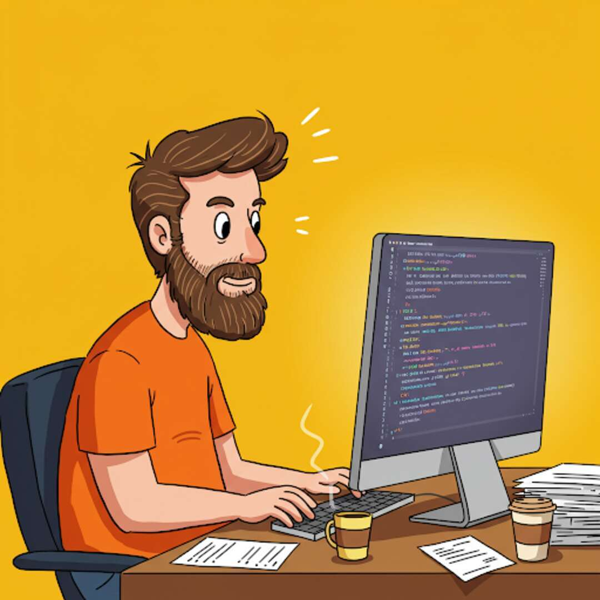
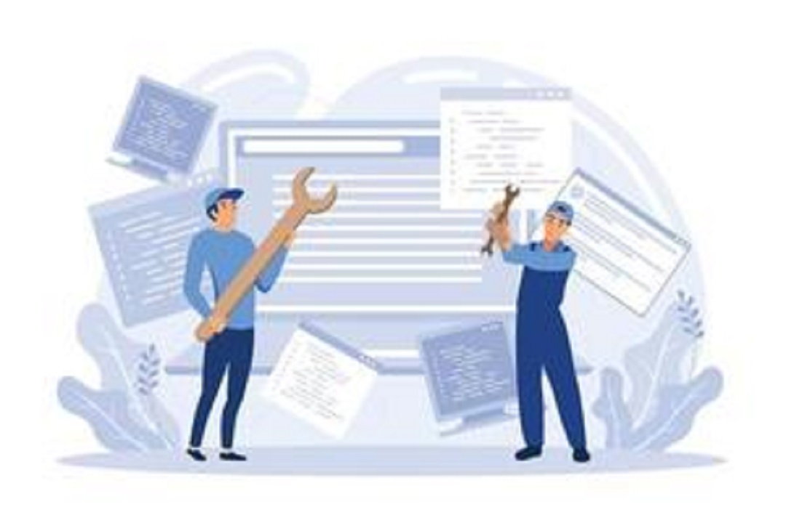
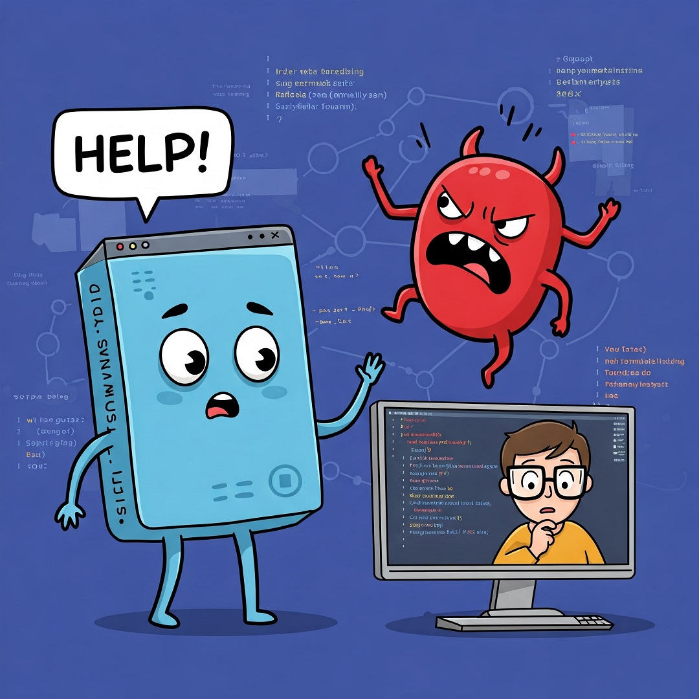
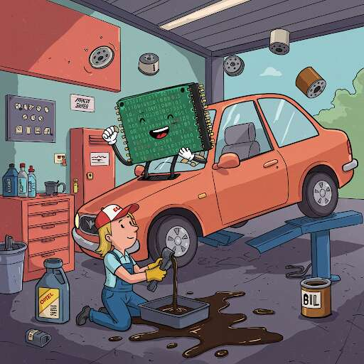
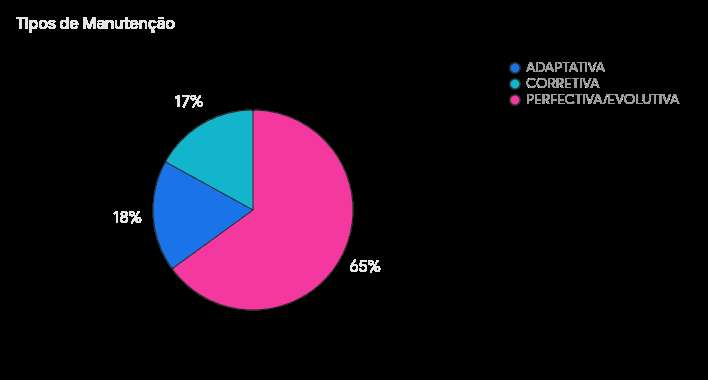

# Introdução à Manutenção de Software

{width="449"}

## 1- Manutenção: definição e características"

### Definição de Manutenção de Software:

{width="423"}

> ***"Manutenção de software é um processo contínuo de mudança em um sistema após sua liberação para uso." -*** **Roger Pressman -** *Engenharia de Software 8a edição*

Segundo Pressman, a Manutenção de Software envolve diversas ações:

1.  **Correção de erros:** Identificação e reparo de defeitos encontrados no software;

2.  **Adaptação:** Modificação do software para que ele continue funcionando em um ambiente operacional ou de negócios em mudança. Isso pode incluir adaptações a novas plataformas, sistemas operacionais ou requisitos de hardware;

3.  **Melhorias:** Implementação de novas características e funcionalidades solicitadas pelos clientes ou outras partes interessadas;

4.  **Suporte ao usuário:** Fornecimento de assistência aos usuários para resolver dúvidas sobre instalação, operação e uso da aplicação;

O processo de modificação de um produto de software após a entrega, para corrigir defeitos, melhorar o desempenho ou outros atributos [Sommerville]. A manutenção é uma parte importante da evolução do software [Sommerville].

### Natureza da Mudança:

Discutir por que o software precisa ser mantido, incluindo correções de bugs, adaptação a novos ambientes, implementação de novos requisitos e manutenção preventiva [Sommerville, Pressman].

A Primeira Lei da Engenharia de Sistemas afirma que *não importa em qual estágio do ciclo de vida, o sistema mudará* [Sommerville - referindo-se à inevitabilidade da mudança].

### Tipos de Manutenção:

Padrão ISO/IEC **14764** - **Engenharia de Software — Processos de Ciclo de Vida — Manutenção**

#### MANUTENÇÕES VOLTADAS A CORREÇÃO DO SOFTWARE

#### Manutenção Corretiva

{width="307"}

É uma manutenção de REAÇÃO a um defeito encontrado para repara-lo.

#### Manutenção Preventiva

{width="249"}

É uma manutenção de Pró-Ação para melhorar a capacidade de manutenibilidade do sistema. Por exemplo, um software específico com arquivo de configuração construído em linguagem XML pode ser reescrito em formato JSON.

#### VOLTADAS AO APRIMORAMENTO DO SOFTWARE (ENHACEMENT)

#### Manutenção Adaptativa

{width="256"}

É uma manutenção de REAÇÃO a uma mudança de ambiente. Exemplo, frente a um novo Navegador (javascript), o cliente web precisa ter seus métodos reescritos.

#### Manutenção Perfectiva (FUNCIONAL ou EVOLUTIVA)

É uma manutenção de Pró-Ação para adicionar FUNCIONALIDADE ou DESEMPENHO ao software ou Sistema de Informação.

#### Distribuição de tempo por tipo de manutenção (Sommerville, 2008)

Adaptativa: 18%

Corretiva: 17%

Perfectiva/Evolutiva: 65%

### Custos da Manutenção:

Mencionar que os custos de manutenção podem frequentemente exceder os custos iniciais de desenvolvimento [Sommerville, Pressman].

## 2- Introdução à Manutenibilidade

### Definição Preliminar:

Apresentar o conceito de manutenibilidade como a facilidade com que o software pode ser modificado [Sommerville, Pressman]. A manutenibilidade é um atributo essencial de um bom software [Sommerville] e um indicativo qualitativo da facilidade de corrigir, adaptar ou melhorar o software [Pressman, 74].

### Importância da Manutenibilidade:

Discutir por que a manutenibilidade é crucial para reduzir os custos e o esforço da manutenção a longo prazo [Sommerville, Pressman]. Qualidade e facilidade de manutenção são resultantes de um projeto bem feito [Pressman, 24].

## Exercícios

### Testes de multipla escolha

| Teste 01 |
|------------------------------------------------------------------------|
| Com base nas Fontes Pressman e Sommerville , como a refatoração é caracterizada no contexto da manutenção de software? |
| A) Como uma técnica para substituir completamente um sistema legado. |
| B) Como um método formal para provar a correção matemática de um software. |
| C) Como uma forma de manutenção preventiva que ajuda a manter o código simples e manutenível. |
| D) Como uma atividade exclusiva da fase inicial de codificação e projeto. |
| E) Como um processo para migrar bancos de dados de um formato para outro durante a reengenharia. |

| Teste 02 |
|------------------------------------------------------------------------|
| Você construiu um sistema ERP e vendeu este a um cliente. Qual das atividades abaixo representa explicitamente um exemplo de manutenção a ser realizada? |
| A) Modernização completa do sistema ERP. |
| B) Substituição do sistema ERP existente por um novo fornecedor. |
| C) Criação de um relatório gerencial de comissão da equipe de vendas. |
| D) Realização de testes de aceitação pelo cliente. |
| E) Implementação de novos módulos que integram departamentos ainda não cobertos. |

| Teste 03 |
|------------------------------------------------------------------------|
| De acordo com o capítulo "Manutenção e Reengenharia" do livro Engenharia de Software do professor Roger Pressman, qual dos seguintes tópicos é explicitamente incluído no estudo da Manutenção de Software? |
| A) Manutenibilidade |
| B) Gerência de Configuração |
| C) Outras Estratégias de Teste |
| D) Metodologia Ativa de Ensino |
| E) Desenvolvimento Baseado em Componentes e Impactos na Manutenção |

| Teste 04 |
|------------------------------------------------------------------------|
| Com base nas informações dos Livros "Engenharia de Software" de Pressman e de Sommerville, como os CUSTOS associados à MANUTENÇÃO e evolução de software geralmente se comparam aos CUSTOS de DESENVOLVIMENTO inicial ? |
| A) Os custos de manutenção são frequentemente mais altos do que os custos iniciais de desenvolvimento. |
| B) Os custos de manutenção são sempre significativamente menores do que os de desenvolvimento inicial. |
| C) Os custos de manutenção são aproximadamente iguais aos custos de desenvolvimento inicial. |
| D) As fontes indicam que a manutenção de software raramente representa um esforço técnico significativo. |
| E) As fontes não fornecem informações sobre a comparação de custos entre manutenção e desenvolvimento. |

| Teste 05 |
|------------------------------------------------------------------------|
| Segundo Sommerville, a refatoração, que é um processo de melhorar a estrutura interna de um sistema de software sem alterar seu comportamento observável, pode ser considerada uma forma de: |
| A) Manutenção Corretiva. |
| B) Manutenção Adaptativa. |
| C) Teste de Unidade. |
| D) Manutenção Preventiva. |
| E) Gerenciamento de Configuração. |

| Teste 06 |
|------------------------------------------------------------------------|
| As atividades de teste de aceitação, onde usuários finais testam o sistema em seu ambiente operacional real para validar se ele atende às suas necessidades, estão mais diretamente relacionadas a qual aspecto da pós-implantação e manutenção/suporte? |
| A) Suporte ao Usuário e Validação do Cliente. |
| B) Teste de Integração Contínua. |
| C) Teste de Unidade. |
| D) Refatoração de código. |
| E) Gerenciamento de versões. |

| Teste 07 |
|------------------------------------------------------------------------|
| Qual atividade de apoio é crucial para gerenciar as mudanças em um software ao longo do tempo, sendo fundamental durante o processo de manutenção/evolução? |
| A) Teste Caixa-Branca. |
| B) Estimativa de Esforço. |
| C) Gerenciamento de Configuração (e ferramenta GIT). |
| D) Modelagem de Requisitos. |
| E) Análise de Valor Limite. |

| Teste 08 |
|------------------------------------------------------------------------|
| Considerando o objetivo geral dos testes de software, conforme mencionado por SommerVille e Pressman, qual é a meta principal ao realizar testes durante as atividades de manutenção Corretiva? |
| A) Provar que o software está completamente livre de erros. |
| B) Descobrir a presença de erros e defeitos para que possam ser corrigidos. |
| C) Apenas medir a velocidade de execução do software. |
| D) Demonstrar que o software se comporta corretamente em todos os cenários possíveis. |
| E) Gerar novas funcionalidades automaticamente. |

| Teste 09 |
|------------------------------------------------------------------------|
| Quando um sistema de software existente precisa ser modificado para operar corretamente com uma nova versão de sistema operacional, um novo banco de dados ou outras mudanças no ambiente de hardware/software em que ele é executado, qual tipo de manutenção está sendo realizada? |
| A) Manutenção Perfectiva. |
| B) Manutenção Adaptativa. |
| C) Manutenção Corretiva. |
| D) Reengenharia de Software. |
| E) Teste de Validação. |

| Teste 10 |
|------------------------------------------------------------------------|
| Adicionar novas funcionalidades, melhorar o desempenho do software, ou aprimorar a usabilidade de um sistema existente são exemplos de qual tipo de manutenção de software? |
| A) Manutenção Corretiva. |
| B) Manutenção Adaptativa. |
| D) Manutenção Perfectiva. |
| C) Teste de Regressão. |
| E) Suporte ao Usuário. |

### Respostas dos testes de multipla escolha

| Teste        | Resposta |
|--------------|----------|
| **Teste_01** | C        |
| **Teste_02** | C        |
| **Teste_03** | A        |
| **Teste_04** | A        |
| **Teste_05** | D        |
| **Teste_06** | A        |
| **Teste_07** | C        |
| **Teste_08** | B        |
| **Teste_09** | B        |
| **Teste_10** | C        |

### 
