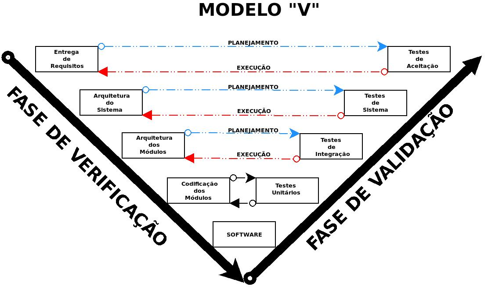

# APROFUNDANDO A MANUTENIBILIDADE E AS TÉCNICAS DE DESENVOLVIMENTO


## Manutenibilidade

> **Manutenibilidade** é um atributo de qualidade do software que representa a facilidade com a qual um produto de software pode ser modificado para corrigir defeitos, adaptar-se a mudanças no ambiente, ou ser aprimorado com novas funcionalidades. Em essência, é um indicador qualitativo da facilidade em corrigir, adaptar ou melhorar o software. Um software "manutenível" é aquele que pode ser facilmente compreendido, modificado e testado. O esforço necessário para localizar e corrigir um erro em um programa é uma forma limitada de definir manutenibilidade. Uma visão mais abrangente considera o esforço necessário para modificar um programa em operação, para adaptar-se a mudanças e para adicionar novas funcionalidades.

### Atributos da Manutenibilidade:

A manutenibilidade é crucial por diversas razões. Vejamos abaixo.

#### Redução de custos a longo prazo:


Investir em manutenibilidade durante o desenvolvimento pode reduzir significativamente os custos de manutenção ao longo da vida útil do sistema. O esforço para adicionar novas funcionalidades após o lançamento é caro, pois exige tempo para entender o sistema e analisar o impacto das alterações.

#### Adaptação a mudanças:


O software precisa evoluir para acompanhar as mudanças nos requisitos do usuário, no ambiente operacional e nas necessidades do negócio. Um sistema manutenível facilita essa adaptação.

#### Correção eficiente de defeitos:


Identificar e corrigir erros em um software bem estruturado e compreensível é mais rápido e menos propenso a introduzir novos problemas.

#### Aumento da vida útil do software:

{width="241"}

Sistemas com alta manutenibilidade podem ser mantidos e evoluídos por um período mais longo, maximizando o retorno sobre o investimento.

#### Facilidade de suporte:

{width="302"}

Uma boa manutenibilidade facilita o trabalho das equipes de suporte, permitindo que resolvam problemas e forneçam assistência aos usuários de forma mais eficaz.

#### Qualidade resultante de um bom projeto:

{width="291"}

Qualidade e facilidade de manutenção são resultados de um projeto bem feito.

## Técnicas de Desenvolvimento para a Manutenibilidade

Vários fatores influenciam a manutenibilidade de um sistema de software:

#### Desenvolvimento Orientado a Objetos (OO):

A OO, com seus conceitos de classes, objetos, encapsulamento, herança e polimorfismo, pode levar a sistemas mais modulares e fáceis de manter. A distribuição homogênea da inteligência do sistema pelas classes aumenta a coesão e reduz o acoplamento.

#### Projeto modular:


Um software com modularidade eficaz (Capítulo 12 - pressman) permite que o desenvolvimento seja planejado mais facilmente, incrementos de software sejam definidos e entregues, mudanças sejam acomodadas com mais facilidade, testes e depuração sejam mais eficazes e a manutenção a longo prazo possa ser realizada sem efeitos colaterais graves. A modularização deve ser feita com cuidado, evitando modularizar demais ou de menos.

#### Coesão e Acoplamento:

Alta coesão dentro dos módulos e baixo acoplamento entre eles tornam o sistema mais fácil de entender e modificar. Se a inteligência do sistema for distribuída de forma mais homogênea pelas classes de uma aplicação, cada objeto conhecerá e fará apenas algumas poucas coisas (que em geral são bem focadas), e a coesão do sistema aumentará. Isso aumenta a facilidade de manutenção do software e reduz o impacto dos efeitos colaterais devido a mudanças.

##### COESÃO

> Robert C. Martin no inicio dos anos 2000 e diz que uma classe **deve ter apenas uma única responsabilidade** e realizá-la de maneira satisfatória, ou seja, **uma classe não deve assumir responsabilidades que não são suas** .

**Classe não-coesa**: a classe "Programa" assume responsabilidades lógicas que não deveriam ser suas. "ObterProduto" deveria ser método de uma classe "Produto". Ao invés disso "ObterProduto" é um método de uma classe "Progama".

``` cpp
// arquivo programa.h

#include <iostream>
#include <string>

public class Programa
 {
     public void ExibirFormulario()    {
         //implementação
     }

     public void ObterProduto()    {
         //implementação
     }

     public void gravarProdutoDB   {
         //implementação
     }
}
```

**Classe coesa**: Na classe "Programa", o botão de interface chama um método de uma classe "Produto" chamado "gravarProduto()".

``` cpp
// arquivo produto.h

#include <iostream>
#include <string>

class Produto {
public:
    // Construtor padrão
    Produto() : id(0), nome(""), preco(0.0) {}

    // Construtor com parâmetros
    Produto(int id, std::string nome, double preco) : id(id), nome(nome), preco(preco) {}

    // Método público para gravar o produto (apenas para demonstração)
    void gravarProduto() {
        std::cout << "Gravando produto..." << std::endl;
        std::cout << "ID: " << id << std::endl;
        std::cout << "Nome: " << nome << std::endl;
        std::cout << "Preço: " << preco << std::endl;
        std::cout << "Produto gravado com sucesso!" << std::endl;

        // Aqui você colocaria a lógica real para gravar o produto
        // em um banco de dados, arquivo, etc.
    }

    // Métodos getters (opcional, mas boa prática)
    int getId() const {
        return id;
    }

    std::string getNome() const {
        return nome;
    }

    double getPreco() const {
        return preco;
    }

    // Métodos setters (opcional, para modificar os atributos)
    void setId(int novoId) {
        id = novoId;
    }

    void setNome(const std::string& novoNome) {
        nome = novoNome;
    }

    void setPreco(double novoPreco) {
        preco = novoPreco;
    }

private:
    int id;
    std::string nome;
    double preco;
};
```

``` cpp
#include <iostream>
#include <string>

#include "produto.h"

public class Programa
 {
       public void MostrarFormulario()     {
         //Implementação
       }

     public void BotaoGravarProduto( ) {
         Produto.gravarProduto();
     }

 }
```

##### ACOPLAMENTO

Acoplamento forte: as classes são construídas umas herdando as outras


Acoplamento fraco: as classes são construídas umas interfaceando com as outras


#### Encapsulamento de informações:

O encapsulamento ajuda a proteger os dados e a reduzir as dependências entre diferentes partes do sistema, facilitando a manutenção e a prevenção de efeitos colaterais inesperados.

Considere a classe CartaoCredito

``` cpp
#include "stdafx.h"
#include <iostream>
#include <string>
 
using namespace std;
 
class CartaoCredito
{
  // Esta declaração esta errada
  // Deste modo é possive capturar o numero do cartão
  // A classe expos o numero para que seja acessivel de outra classe
  // para não expor os numero use private
 
// private: 
 public:
 
 string  numeroCartao; // <======================= olha isso
 double  gastos;
 
//public:
  void cobranca(string nCartao, double valor)
  {
    numeroCartao = nCartao;
    gastos = gastos + valor;
  }
 
// construtor

   CartaoCredito()
  {
  }
};
```

Considere a implementação abaixo

``` cpp
#include "stdafx.h"
#include <iostream>
#include <string>
#include "cartaocredito.h"
 
using namespace std;
 
void metodoMalicioso(CartaoCredito& cartao)
 {
    cartao.gastos = 0;
    cout << "Seu numero de cartão: " << cartao.numeroCartao;
 }
 
int _tmain(int argc, _TCHAR* argv[])
 {
   // Uma transação hipotetica
   CartaoCredito transacao;
   transacao.cobranca("3453 3636 0001 1267", 350.00);
 
   // Metodo malicioso Injeta um gasto valor de 0 e imprime o numero do cartão
   metodoMalicioso(transacao);
 
   cout << endl;
 
   system("pause");
 
   return 0;
 }
```

Devido ao erro de encapsulamento do atributo **numeroCartao** da classe **CartaoCredito**, o método independente **metodoMalicioso** tem acesso aos atributos instríssecos da classe.

#### Padrões de projeto:

{width="400"}

Aplicar padrões de projeto ajuda a criar soluções bem estabelecidas e compreensíveis para problemas de design comuns. Isso facilita a comunicação entre os desenvolvedores e torna o código mais previsível e manutenível.

[Documentação do site refactoring.guru](https://refactoring.guru/pt-br/design-patterns/cpp)

**Criacionais**

| Nome do Padrão | Descrição |
|--------------------|----------------------------------------------------|
| Abstract Factory | Fornece uma interface para criar famílias de objetos relacionados ou dependentes sem especificar suas 1 classes concretas. Permite criar diferentes "produtos" seguindo uma interface comum, de forma que o código cliente não dependa das implementações específicas desses produtos. |
| Builder | Separa a construção de um objeto complexo de sua representação, de modo que o mesmo processo de construção pode criar diferentes representações. 2 Útil quando a criação de um objeto envolve muitos passos ou configurações opcionais, oferecendo uma forma mais flexível e legível de construir objetos complexos em comparação com construtores sobrecarregados. |
| Factory Method | Define uma interface para criar um objeto, mas permite que as subclasses alterem o tipo de objetos que serão criados. 3 Delega a lógica de instanciação para subclasses, tornando o código mais flexível para extensões futuras, pois novas classes de produtos podem ser introduzidas sem modificar o código cliente existente. |
| Prototype | Especifica os tipos de objetos a serem criados usando uma instância prototípica e cria novos objetos copiando este protótipo. 4 Permite criar novos objetos evitando o conhecimento detalhado das classes concretas e pode ser mais eficiente em alguns casos do que usar construtores padrão, especialmente quando a criação de instâncias é um processo custoso. |
| Singleton | Garante que uma classe tenha apenas uma instância e fornece um ponto de acesso global para ela. Útil para gerenciar recursos compartilhados, configurações globais ou serviços únicos dentro de um sistema. É importante implementar o padrão Singleton com cuidado para evitar problemas de concorrência e testabilidade. |

**Estruturais**

| Nome do Padrão | Descrição |
|-----------------|-------------------------------------------------------|
| Adapter | Permite que classes com interfaces incompatíveis trabalhem juntas. Atua como um invólucro (wrapper) que converte a interface de uma classe em outra interface esperada pelos clientes. Facilita a reutilização de classes existentes que não atendem diretamente às necessidades da aplicação. |
| Bridge | Desacopla uma abstração de sua implementação, de modo que as duas podem evoluir independentemente. Em vez de ter uma hierarquia de classes única que combina abstração e implementação, o padrão Bridge introduz duas hierarquias separadas: uma para a abstração e outra para a implementação, permitindo maior flexibilidade e evitando a proliferação de classes. |
| Composite | Compõe objetos em estruturas de árvore para representar hierarquias do tipo "todo-parte". Permite que os clientes tratem objetos individuais e composições 1 de objetos de maneira uniforme. Facilita a criação de estruturas complexas e a aplicação de operações de forma recursiva sobre essas estruturas. |
| Decorator | Adiciona responsabilidades a um objeto dinamicamente. Fornece uma alternativa flexível ao uso de subclasses para estender a funcionalidade. Envolve um objeto existente com um novo objeto "decorador" que adiciona comportamento adicional, mantendo a mesma interface do objeto original. |
| Facade | Fornece uma interface unificada para um conjunto de interfaces em um subsistema. Define uma interface de nível superior que torna o subsistema mais fácil de usar. Simplifica a interação com um sistema complexo, expondo apenas um ponto de entrada de alto nível. |
| Flyweight | Utiliza o compartilhamento para suportar eficientemente um grande número de objetos de granularidade fina. Separa o estado intrínseco (compartilhado) do estado extrínseco (não compartilhado) de um objeto. O estado intrínseco é armazenado nos objetos Flyweight e compartilhado, enquanto o estado extrínseco é passado para os métodos do Flyweight quando necessário. Isso pode reduzir significativamente o consumo de memória quando muitos objetos semelhantes precisam ser criados. |
| Proxy | Fornece um marcador (placeholder) para outro objeto a fim de controlar o acesso a ele. Um Proxy atua como um intermediário, controlando quando e como o objeto real é acessado. Pode ser usado para diversas finalidades, como lazy initialization, controle de acesso, logging, etc. |

**Comportamentais**

| Nome do Padrão | Descrição |
|-------------------|-----------------------------------------------------|
| Chain of Responsibility | Um padrão comportamental |
| Command | Um padrão comportamental que permite enviar solicitações sem saber quem as recebe ou o que está sendo solicitado |
| Interpreter | Um padrão comportamental |
| Iterator | Um padrão comportamental |
| Mediator | Um padrão que promove o baixo acoplamento entre classes |
| Memento | Um padrão que permite salvar e restaurar o estado de um objeto |
| Observer | Um padrão que permite que um mesmo objeto tenha várias representações |
| Strategy | Um padrão que permite definir uma família de algoritmos e torná-los intercambiáveis |
| Template Method | Um padrão comportamental |
| Visitor | Um padrão comportamental |

#### Padrões e convenções de codificação:

A adoção de padrões e convenções de codificação bem definidos leva a um código-fonte autodocumentado e inteligível, facilitando a leitura e a compreensão.

{width="869"}

#### Documentação:

Embora métodos ágeis busquem minimizar a documentação formal, é importante criar documentos que serão consultados mais adiante no processo de desenvolvimento. Descrições precisas contribuem para a redução dos custos de manutenção.

#### Qualidade do código:

A produção de códigos de alta qualidade e legíveis é fundamental para a implementação de software manutenível.

#### Desenvolvimento Guiado por Testes (TDD):

O TDD envolve a escrita de testes antes da implementação do código. Isso leva a um código mais testável e, consequentemente, mais manutenível, pois a testabilidade é um fator de qualidade importante.

{width="550"}

A realização de testes (unitários, de integração, de ponta a ponta) garante que as modificações não introduzam novos defeitos e que o sistema continue funcionando corretamente. Testes de regressão são importantes para garantir que alterações não produzam efeitos colaterais involuntários.

#### Refatoração:

A refatoração aprimora a estrutura interna de um projeto (ou código-fonte) sem alterar sua funcionalidade ou comportamento externos. Ela mantém o código simples e manutenível e evita a degradação do código que aumenta os custos e as dificuldades de manutenção.

#### Gerenciamento de configuração:

O gerenciamento de configuração gerencia as alterações de forma apropriada, controla as versões do software e dos artefatos do projeto, e mantém a integridade do sistema ao longo do tempo. A matriz de rastreabilidade documenta as dependências entre requisitos, decisões de arquitetura e causas de defeito, auxiliando na determinação do impacto de uma alteração proposta.

Más práticas de desenvolvimento, como **falta de estabilidade da equipe** e **incentivos inadequados para escrever software manutenível** durante o desenvolvimento, podem impactar negativamente a manutenibilidade.

#### Integração Contínua e Entrega Contínua (CI/CD):

A CI/CD facilita a detecção precoce de problemas e garante que as alterações sejam integradas e testadas frequentemente, reduzindo o risco de grandes problemas durante a manutenção e evolução. Testes de regressão automatizados são uma parte crucial desse processo.

#### Metodologias Ágeis:

Embora a documentação formal seja minimizada, os métodos ágeis enfatizam a importância de software funcionando e a atenção contínua à excelência técnica e bom design, o que contribui para a manutenibilidade. A refatoração é uma prática comum em metodologias ágeis.
