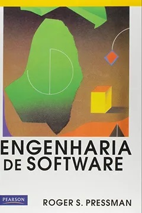
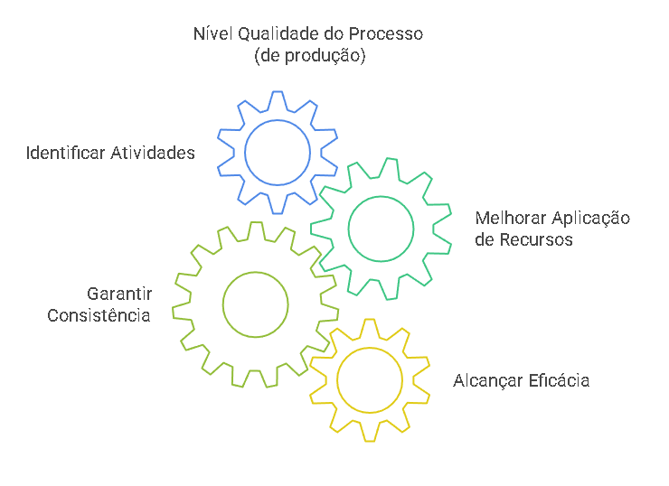
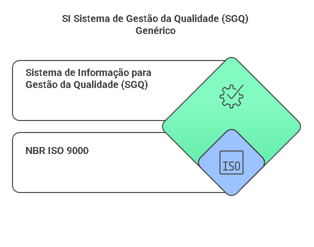
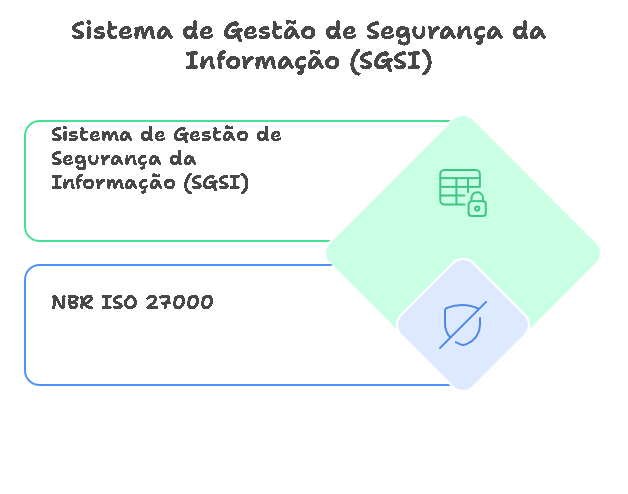
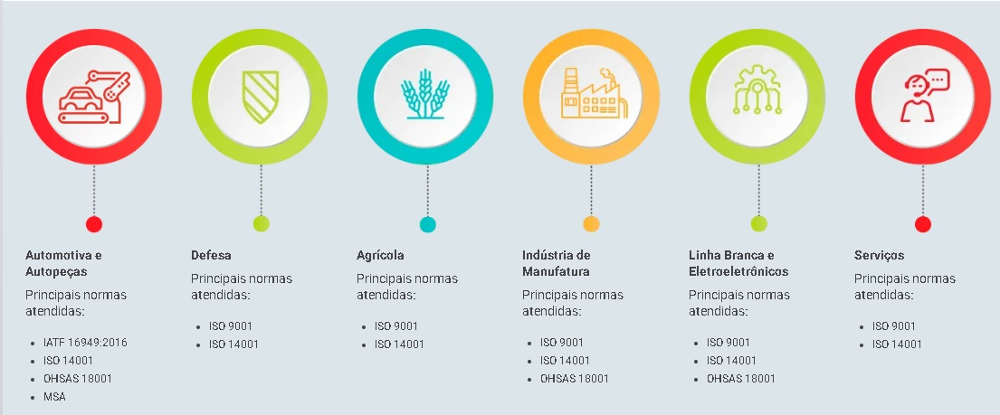
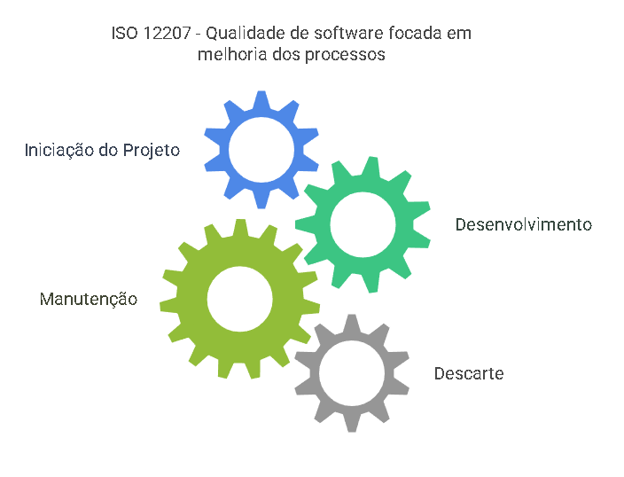

# Sobre estas anotações {.unnumbered}

Estas anotações são apenas lembretes das aulas expostas em sala, durante a disciplina de ENGENHARIA DE SOFTWARE.

## ACESSO AO GITBOOK CELULAR

## <https://miguel7penteado.github.io/ADS-EngenhariaSoftware2025>


## APP EPUB ANDROID

## **Moon+ Reader**


# Livros Texto da Disciplina

#### "Engenharia de Software" do autor "Roger S Pressman"



|  |  |
|----|----|
| **Autor(es)** | [Roger S. Pressman](https://www.indicalivros.com/autores?q=Roger%20S.%20Pressman) |
| **Editora** | Pearson |
| **Idioma** | Português |
| **ISBN** | 8534602379 9788534602372 |
| **Formato** | Capa comum |
| **Páginas** | 1056 |
| **Código Biblioteca** |  |

#### "Engenharia de Software" do autor "Ian Sommerville"


|                       |                 |
|-----------------------|-----------------|
| **Autor(es)**         | Ian SommerVille |
| **Editora**           | Pearson         |
| **Idioma**            | Português       |
| **ISBN**              | 9788588639072   |
| **Formato**           | Capa comum      |
| **Páginas**           | 768             |
| **Código Biblioteca** |                 |

Calendário das aulas

##### FEVEREIRO 2025

|                 |               |                |
|-----------------|---------------|----------------|
| Data            | Dia da semana | Aulas          |
| 4 de fevereiro  | Terça-feira   |                |
| 11 de fevereiro | Terça-feira   |                |
| 18 de fevereiro | Terça-feira   | Aula Inaugural |
| 25 de fevereiro | Terça-feira   |                |

##### MARÇO 2025

|             |               |       |
|-------------|---------------|-------|
| Data        | Dia da semana | Aulas |
| 4 de março  | Terça-feira   |       |
| 11 de março | Terça-feira   |       |
| 18 de março | Terça-feira   |       |
| 25 de março | Terça-feira   |       |

##### ABRIL DE 2025

|             |               |       |
|-------------|---------------|-------|
| Data        | Dia da semana | Aulas |
| 1 de abril  | Terça-feira   |       |
| 8 de abril  | Terça-feira   |       |
| 15 de abril | Terça-feira   |       |
| 22 de abril | Terça-feira   |       |
| 29 de abril | Terça-feira   |       |

##### MAIO DE 2025

|            |               |       |
|------------|---------------|-------|
| Data       | Dia da semana | Aulas |
| 6 de maio  | Terça-feira   |       |
| 13 de maio | Terça-feira   |       |
| 20 de maio | Terça-feira   |       |
| 27 de maio | Terça-feira   |       |

##### JUNHO DE 2025

|             |               |       |
|-------------|---------------|-------|
| Data        | Dia da semana | Aulas |
| 3 de junho  | Terça-feira   |       |
| 10 de junho | Terça-feira   |       |
| 17 de junho | Terça-feira   |       |
| 24 de junho | Terça-feira   |       |

```{r, eval=FALSE}
bookdown::render_book()
```

```{r include=FALSE}
# automatically create a bib database for R packages
knitr::write_bib(c(
  .packages(), 'bookdown', 'knitr', 'rmarkdown'
), 'packages.bib')
```

<!--chapter:end:index.Rmd-->

# INTRODUÇÃO A DISCIPLINA DE ENGENHARIA DE SOFTWARE {.unnumbered}

Do que trata esta disciplina e o que quer dizer o termo que dá nome a ela ?

## O que é ENGENHARIA DE SOFTWARE

{width="92"}

> **Engenharia de Software** *é o processo de desenvolvimento de programas de computador, estruturas de dados e documentos.* (***Roger S. Pressman***)

{width="102"}

> **Engenharia de Software** *é uma disciplina de engenharia que se preocupa com todo o processo de produção de software. Isso inclui desde a especificação do sistema até a sua manutenção.* (**Ian Sommerville**)

É atribuído a **Margaret Hamilton,** desenvolvedora do programa de navegação da APOLLO 11 a criação do termo ENGENHARIA DE SOFTWARE.

{width="50%"}

<!--chapter:end:00-introducao.Rmd-->

# QUALIDADE DE SOFTWARE

## COMPLIANCE

Para que uma organização consiga fechar contrados de venda ou fornecimento com outra organização, especialmente quando o valor do contrato de venda ou prestação é muito alto, há um processo de checagem de COMPLIANCE:


## QUALIDADE

O que é Qualidade ? (Definição ISO 9000)

> Qualidade é definida como o grau em que um conjunto de características inerentes de um objeto satisfaz requisitos onde: **Características inerentes** São propriedades que fazem parte do objeto, onde:
>
> -   **Requisitos**: São as necessidades ou expectativas declaradas, geralmente implícitas ou obrigatórias;
>
> -   **objeto** pode ser representado por um produto, serviço, processo, organização, sistema ou pessoa;


### QUALIDADE APLICADA A PRODUTO

O CONTROLE DE QUALIDADE do PRODUTO concentra-se em aperfeiçoar:

-   as **características** e

-   o **desempenho** do produto em si,

visando atender às necessidades e expectativas dos clientes.


### QUALIDADE APLICADA A PROCESSO

O CONTROLE DE QUALIDADE DE PROCESSO concentra-se em aperfeiçoar

-   as **atividades** e

-   melhor **aplicação dos recursos**

utilizados para criar o produto, visando garantir a consistência e a eficácia da produção.



### CASO MACDONALDS - Qualidade de Produto e Processo

O filme "Fome de Poder" ("The Founder", no original) narra a história real da ascensão da rede McDonald's, desde sua origem como uma pequena hamburgueria na Califórnia até se tornar um império global do fast-food.

-   Reconhecimento da **qualidade do produto** - hamburguers McDonalds


Reconhecimento da **Qualidade do Processo** de fabricação do Produto


-   Reconhecimento da Capacidade de Franquia (Replicação):

{width="407"}

### QUALIDADE NAS ORGANIZAÇÕES

### Família ISO 9000

**A NBR ISO 9000** é um conjunto de normas técnicas que estabelecem diretrizes e padrões para a criação de um **Sistema de Gestão da Qualidade (SGQ)**.

O sistema SGQ (um si que pode ou não ser um pacote de software) deve mapear

|  |  |  |  |  |
|:--:|:--:|:--:|:--:|:--:|
| Áreas mapeadas por um sistema SGQ | PROCESSOS | POLÍTICAS | PROCEDIMENTOS | RESPONSABILIDADES |

{width="549"}

### Família ISO 14000

**A NBR ISO 14000** é um conjunto de normas técnicas que tratam de GESTÃO AMBIENTAL nas organizações. Estabelecem normas e diretrizes para criar **(SI) Sistemas de Gestão Ambiental (SGA)**:


### Família ISO 27000

**NBR ISO 27000**, trata de normas para **gestão segurança da Informação.** Fornecem um framework para a gestão da segurança da informação em organizações.

Especifica os requisitos para um para a criação de um(SI) Sistema de Gestão de Segurança da Informação (SGSI).



### Segmentos das Organizações e Adoção das normas de Qualidade



### QUALIDADE NA ENGENHARIA DE SOFTWARE

A qualidade de software não define S.I.s

### Família NBR ISO 9126

Focava na qualidade do produto de software, definindo um conjunto de parâmetros para padronizar a avaliação dessa qualidade. Ela se enquadrava no modelo de qualidade das normas da família 9000.


### Família NBR ISO 12207

A norma ISO 12207 define um conjunto de processos para o ciclo de vida do software. Seu principal foco é estabelecer um framework padronizado para o desenvolvimento, manutenção e descarte de software, visando garantir a qualidade e a eficiência desses processos.




### Família NBR ISO 25000

**A NBR ISO 25000**, também conhecida como SQuaRE (Software Product Quality Requirements and Evaluation - Requisitos e Avaliação da Qualidade de Produtos de Software), é uma série de normas internacionais que fornecem um subconjunto de normas para a avaliação da qualidade de produtos de software. Este subconjunto é formado pelas normas **ISO/IEC 25000** , **ISO/IEC 25010**, **ISO/IEC 25020**, **ISO/IEC 25030** e **ISO/IEC 25040**.


<!--chapter:end:01-qualidade-software.Rmd-->

# Verificação de Validação de Software


## Verificação de Softare:

> **Definição de Verificação de Software**: *Assegurar que o software implementa corretamente uma função específica. "Estamos criando o produto corretamente?*".

## Validação de Softare:

> **Definição de Validação de Software**: *Assegurar que o software foi criado e pode ser rastreado segundo os requisitos do cliente. "Estamos criando o produto certo?". Validação tem sucesso quando o software funciona de uma maneira que pode ser razoavelmente esperada pelo cliente.*

## Classificação das Técnicas:

### Técnicas Estáticas

As Técnicas Estáticas são Inspeções e revisões que analisam os requisitos do sistema, modelos de projeto e o código-fonte do programa sem executá-lo.

### Técnicas Dinâmicas

As Técnicas Dinâmicas são testes de software, nos quais o sistema é executado com dados de testes simulados.

### Abordagens Formais

Já as abordagens formais são técnicas usadas para softwares críticos (usinas nucleares, navegação aérea, cirurgia robótica). Os processo de Prova de correção, o processo sala limpa (clean room).

## Revisões Técnicas: PASSEIO e INSPEÇÃO

As **Revisões Técnicas (RT)** são Reuniões conduzidas por membros da equipe de software para avaliar a qualidade do software.

#### As revisões técnicas podem ser "Informais" ou "Formais"

As **Revisões Informais** incluem testes de mesa e reuniões informais com colegas.

As **Revisões Técnicas Formais** são feitas com Reuniões estilizadas com papéis definidos, planejamento antecipado e manutenção de registros.

### Passeio (Walkthrough)

O produtor "repassa" o artefato, explicando o material, enquanto os revisores levantam questões com base em sua preparação prévia.

### Inspeção do produto

Uma pequena equipe verifica o código sistematicamente, procurando por possíveis erros e omissões.

<!--chapter:end:02-Verificacao-Validacao-software.Rmd-->

# Estudo da Entrega #01 - ERP Agrotec - Módulo Cadastros

## Interface JanelaPrincipal

Os aquivos estão na pasta "ProjetoERP-AGROTEC\\01ModuloCadastros\\03codificacao\source" do repositório da disciplina

Arquivo *ERPAgroTech.py*

``` python

# -*- coding: utf-8 -*-

###########################################################################
## Python code generated with wxFormBuilder (version 4.2.1-0-g80c4cb6)
## http://www.wxformbuilder.org/
##
## PLEASE DO *NOT* EDIT THIS FILE!
###########################################################################

import wx
import wx.xrc

import gettext
_ = gettext.gettext


from CadastroClientes import TipoCadastroClientes

###########################################################################
## Class TipoJanelaPrincipal
###########################################################################

class TipoJanelaPrincipal ( wx.Frame ):

   def __init__( self, parent ):
       wx.Frame.__init__ ( self, parent, id = wx.ID_ANY, title = _(u"ERP AGROTEC - Entrega 01"), pos = wx.DefaultPosition, size = wx.Size( 641,514 ), style = wx.DEFAULT_FRAME_STYLE|wx.TAB_TRAVERSAL )

       self.SetSizeHints( wx.DefaultSize, wx.DefaultSize )

       self.TipoMenuPrincipal = wx.MenuBar( 0 )
       self.TipoMenuArquivo = wx.Menu()
       self.TipoMenuItemSair = wx.MenuItem( self.TipoMenuArquivo, wx.ID_ANY, _(u"Sair"), wx.EmptyString, wx.ITEM_NORMAL )
       self.TipoMenuArquivo.Append( self.TipoMenuItemSair )

       self.TipoMenuPrincipal.Append( self.TipoMenuArquivo, _(u"Arquivo") )

       self.TipoMenuCadastro = wx.Menu()
       self.TipoMenuItemClientes = wx.MenuItem( self.TipoMenuCadastro, wx.ID_ANY, _(u"Clientes"), wx.EmptyString, wx.ITEM_NORMAL )
       self.TipoMenuCadastro.Append( self.TipoMenuItemClientes )

       self.TipoMenuItemFornecedores = wx.MenuItem( self.TipoMenuCadastro, wx.ID_ANY, _(u"Fornecedores"), wx.EmptyString, wx.ITEM_NORMAL )
       self.TipoMenuCadastro.Append( self.TipoMenuItemFornecedores )

       self.TipoMenuItemProdutos = wx.MenuItem( self.TipoMenuCadastro, wx.ID_ANY, _(u"Produtos"), wx.EmptyString, wx.ITEM_NORMAL )
       self.TipoMenuCadastro.Append( self.TipoMenuItemProdutos )

       self.TipoSubmenuRelatorios = wx.Menu()
       self.TipoMenuItemRelatorioClientes = wx.MenuItem( self.TipoSubmenuRelatorios, wx.ID_ANY, _(u"Relatório de Clientes"), wx.EmptyString, wx.ITEM_NORMAL )
       self.TipoSubmenuRelatorios.Append( self.TipoMenuItemRelatorioClientes )

       self.TipoMenuItemRelatorioFornecedores = wx.MenuItem( self.TipoSubmenuRelatorios, wx.ID_ANY, _(u"Relatório de Fornecedores"), wx.EmptyString, wx.ITEM_NORMAL )
       self.TipoSubmenuRelatorios.Append( self.TipoMenuItemRelatorioFornecedores )

       self.TipoMenuItemRelatorioProdutos = wx.MenuItem( self.TipoSubmenuRelatorios, wx.ID_ANY, _(u"Relatório de Produtos"), wx.EmptyString, wx.ITEM_NORMAL )
       self.TipoSubmenuRelatorios.Append( self.TipoMenuItemRelatorioProdutos )

       self.TipoMenuCadastro.AppendSubMenu( self.TipoSubmenuRelatorios, _(u"Relatórios") )

       self.TipoMenuPrincipal.Append( self.TipoMenuCadastro, _(u"Cadastro") )

       self.SetMenuBar( self.TipoMenuPrincipal )

       self.TipoBarraStatus = self.CreateStatusBar( 1, wx.STB_SIZEGRIP, wx.ID_ANY )
       self.TipoBarraStatus.SetBackgroundColour( wx.SystemSettings.GetColour( wx.SYS_COLOUR_INFOBK ) )


       self.Centre( wx.BOTH )

       # Connect Events
       self.Bind( wx.EVT_MENU, self.EventoTerminarPrograma,                id = self.TipoMenuItemSair.GetId()                  )
       self.Bind( wx.EVT_MENU, self.EventoAbrePainelClientes,              id = self.TipoMenuItemClientes.GetId()              )
       self.Bind( wx.EVT_MENU, self.EventoAbrePainelFornecedores,          id = self.TipoMenuItemFornecedores.GetId()          )
       self.Bind( wx.EVT_MENU, self.EventoAbrePainelProdutos,              id = self.TipoMenuItemProdutos.GetId()              )
       self.Bind( wx.EVT_MENU, self.EventoAbrePainelRelatorioClientes,     id = self.TipoMenuItemRelatorioClientes.GetId()     )
       self.Bind( wx.EVT_MENU, self.EventoAbrePainelRelatorioFornecedores, id = self.TipoMenuItemRelatorioFornecedores.GetId() )
       self.Bind( wx.EVT_MENU, self.EventoAbrePainelRelatorioProdutos,     id = self.TipoMenuItemRelatorioProdutos.GetId()     )

   def __del__( self ):
       pass

   def MakeModal(self, modal=True):
       if modal and not hasattr(self, '_disabler'):
           self._disabler = wx.WindowDisabler(self)
       if not modal and hasattr(self, '_disabler'):
           del self._disabler

   # Virtual event handlers, override them in your derived class
   def EventoTerminarPrograma( self, event ):
       event.Skip()

   def EventoAbrePainelClientes( self, event ):
       janelaClientes = TipoCadastroClientes(None)
       janelaClientes.MakeModal()
       janelaClientes.Show()
       

   def EventoAbrePainelFornecedores( self, event ):
       event.Skip()

   def EventoAbrePainelProdutos( self, event ):
       event.Skip()

   def EventoAbrePainelRelatorioClientes( self, event ):
       event.Skip()

   def EventoAbrePainelRelatorioFornecedores( self, event ):
       event.Skip()

   def EventoAbrePainelRelatorioProdutos( self, event ):
       event.Skip()
```

Arquivo main.py

``` python

# -*- coding: utf-8 -*-


import wx

from ERPAgroTech import TipoJanelaPrincipal

class Programa(TipoJanelaPrincipal):
    def __init__(self, parent):
        TipoJanelaPrincipal.__init__(self, parent)


app = wx.App(False)    # cria uma nova aplicação e não redireciona stdout e stderr para janela principal
frame = Programa(None) # frame é uma janela de nível de topo
frame.MakeModal()
frame.Show()           # Mostra a janela
app.MainLoop()         # aplicação entra em loop até finalizar
```

### Como executar a janela principal

1.  Baixar o e instalar o Python (preferencialmente a [versão 3.9 para Windows 10 ou 11](https://www.python.org/ftp/python/3.9.0/python-3.9.0-amd64.exe))

2.  Abrir uma janela do MS-DOS (prompt de comando) e mandar o utilitário **PIP** instalar o pacote **wxpython:**

``` cmd
pip install --upgrade wxphython
```

3.  Abrir uma janela do MS-DOS (prompt de comando) e mandar o utilitário e baixar o repositório da disciplina com a ferramenta GIT:

``` cmd
git clone git@github.com:miguel7penteado/ADS-EngenhariaSoftware2025.git
```

4.  Pelo MS-DOS entrar na pasta ProjetoERP-AGROTEC\\01ModuloCadastros\\03codificacao\source :

``` cmd
cd ADS-EngenhariaSoftware2025\ProjetoERP-AGROTEC\01ModuloCadastros\03codificacao\source
```

5.  Pelo MS-DOS mandar o interpretador python executar o ERP AGROTEC

``` cmd
python3 main.py
```

## Cadastro de Clientes

Acesso ao Banco de Dados na núvem POSTGRES para você testar o seu:

| host:    | pg-ads-engs2-miguel7penteado-ads-engs2.c.aivencloud.com |
|----------|---------------------------------------------------------|
| porta:   | 17135                                                   |
| usuario: | SEU RA                                                  |
| senha:   | SEU RA                                                  |
| banco:   | banco-dados-ra                                          |
| SSL:     | require                                                 |

OBS: substitua "ra" pelo seu ra, obviamente.

Cliente para testar via celular:

Android Postgresql Client

<https://play.google.com/store/apps/details?id=rafrobsystems.postgresclient&pcampaignid=web_share>


### Tabela Clientes

``` sql
CREATE TABLE clientes
(
id         varchar(15) unique not null,
nome       varchar(500) not null ,
endereco   varchar(500) not null ,
nascimento date
);
```

## Cadastro de Fornecedores

## Cadastro de Produtos

<!--chapter:end:03-gestao-qualidade.Rmd-->

# GERÊNCIA DE PROJETOS

Coming soon

<!--chapter:end:04-gerencia-projeto.Rmd-->

# Sharing your book

## Publishing

HTML books can be published online, see: https://bookdown.org/yihui/bookdown/publishing.html

## 404 pages

By default, users will be directed to a 404 page if they try to access a webpage that cannot be found. If you'd like to customize your 404 page instead of using the default, you may add either a `_404.Rmd` or `_404.md` file to your project root and use code and/or Markdown syntax.

## Metadata for sharing

Bookdown HTML books will provide HTML metadata for social sharing on platforms like Twitter, Facebook, and LinkedIn, using information you provide in the `index.Rmd` YAML. To setup, set the `url` for your book and the path to your `cover-image` file. Your book's `title` and `description` are also used.


This `gitbook` uses the same social sharing data across all chapters in your book- all links shared will look the same.

Specify your book's source repository on GitHub using the `edit` key under the configuration options in the `_output.yml` file, which allows users to suggest an edit by linking to a chapter's source file. 

Read more about the features of this output format here:

https://pkgs.rstudio.com/bookdown/reference/gitbook.html

Or use:

```{r eval=FALSE}
?bookdown::gitbook
```


<!--chapter:end:05-share.Rmd-->

`r if (knitr::is_html_output()) '
# References {-}
'`

<!--chapter:end:06-references.Rmd-->

