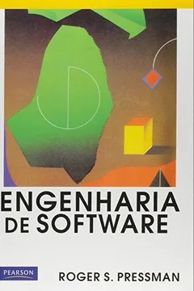
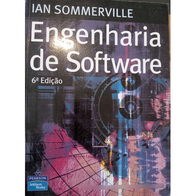

# Sobre estas anotações {.unnumbered}

Estas anotações são apenas lembretes das aulas expostas em sala, durante a disciplina de ENGENHARIA DE SOFTWARE.

## ACESSO AO GITBOOK CELULAR

## <https://miguel7penteado.github.io/ADS-EngenhariaSoftware2025>


# Livros Texto da Disciplina

#### "Engenharia de Software" do autor "Roger S Pressman"



|  |  |
|----------------------------------|--------------------------------------|
| **Autor(es)** | [Roger S. Pressman](https://www.indicalivros.com/autores?q=Roger%20S.%20Pressman) |
| **Editora** | Pearson |
| **Idioma** | Português |
| **ISBN** | 8534602379 9788534602372 |
| **Formato** | Capa comum |
| **Páginas** | 1056 |
| **Código Biblioteca** |  |

#### "Engenharia de Software" do autor "Ian Sommerville"



|                       |                 |
|-----------------------|-----------------|
| **Autor(es)**         | Ian SommerVille |
| **Editora**           | Pearson         |
| **Idioma**            | Português       |
| **ISBN**              | 9788588639072   |
| **Formato**           | Capa comum      |
| **Páginas**           | 768             |
| **Código Biblioteca** |                 |

Calendário das aulas

##### FEVEREIRO 2025

|                 |               |       |
|-----------------|---------------|-------|
| Data            | Dia da semana | Aulas |
| 4 de fevereiro  | Terça-feira   |       |
| 11 de fevereiro | Terça-feira   |       |
| 18 de fevereiro | Terça-feira   |       |
| 25 de fevereiro | Terça-feira   |       |

##### MARÇO 2025

|             |               |       |
|-------------|---------------|-------|
| Data        | Dia da semana | Aulas |
| 4 de março  | Terça-feira   |       |
| 11 de março | Terça-feira   |       |
| 18 de março | Terça-feira   |       |
| 25 de março | Terça-feira   |       |

##### ABRIL DE 2025

|             |               |       |
|-------------|---------------|-------|
| Data        | Dia da semana | Aulas |
| 1 de abril  | Terça-feira   |       |
| 8 de abril  | Terça-feira   |       |
| 15 de abril | Terça-feira   |       |
| 22 de abril | Terça-feira   |       |
| 29 de abril | Terça-feira   |       |

##### MAIO DE 2025

|            |               |       |
|------------|---------------|-------|
| Data       | Dia da semana | Aulas |
| 6 de maio  | Terça-feira   |       |
| 13 de maio | Terça-feira   |       |
| 20 de maio | Terça-feira   |       |
| 27 de maio | Terça-feira   |       |

##### JUNHO DE 2025

|             |               |       |
|-------------|---------------|-------|
| Data        | Dia da semana | Aulas |
| 3 de junho  | Terça-feira   |       |
| 10 de junho | Terça-feira   |       |
| 17 de junho | Terça-feira   |       |
| 24 de junho | Terça-feira   |       |

```{r, eval=FALSE}
bookdown::render_book()
```

```{r include=FALSE}
# automatically create a bib database for R packages
knitr::write_bib(c(
  .packages(), 'bookdown', 'knitr', 'rmarkdown'
), 'packages.bib')
```
